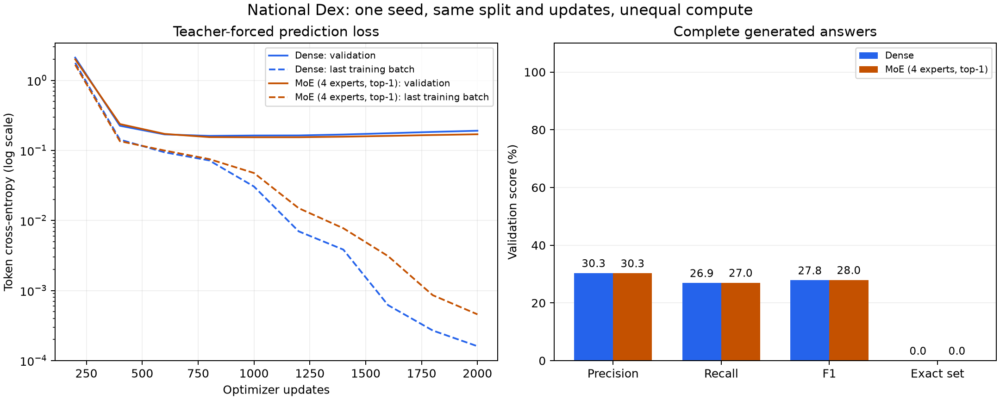

# Lesson 4: a low loss can hide a failed research objective

**2026-09-24.** We moved from toy tests to the real National Dex corpus. The
dense model learns its training answers, but its complete validation answers
fail badly. This is why we built a generation evaluator before optimizing speed.



The [campaign report](../experiments/2026-09-24-quality-campaign.json) preserves
aggregate metrics, per-dimension results, failures and hashes of the raw inputs.

## What was held fixed

The [recorded plan](../experiments/2026-09-24-quality-campaign-plan.md) uses 1,637
training queries, 222 validation queries and 191 protected test queries. Dense
and four-expert/top-1 MoE each receive 2,000 optimizer updates, batch size 32,
initialization seed 1729 and the same query partition. We evaluate their final
checkpoints, preserving intermediate loss observations as diagnostics.

The models have different parameter counts and compute costs. This experiment
compares performance at equal updates, not equal compute. It is also one model
seed, not a statistically established advantage. Three baseline initialization
seeds use the same fixed split. The final test remains unused.

This is **transductive query generalization**: held-out subject/dimension queries
use entities that can appear in other training queries and target lists. It is
not a test of new products or unobserved token IDs.

## The loss curves looked encouraging

Dense validation token cross-entropy fell from 2.1095 at update 200 to 0.1612 at
update 800, then rose to 0.1908 at update 2,000. Its last training-batch loss fell
to 0.000160. MoE validation loss reached 0.1541 at update 1,000 and ended at
0.1699. These are token losses; MoE's router penalty is reported separately.

Training keeps improving while validation degrades: this is evidence consistent
with **overfitting**, or increasingly specific adaptation to training examples.
The plotted training value is the most recent batch, whereas validation is a
token-weighted pass over all validation records. Do not interpret every gap as
an exactly matched population comparison.

We keep the planned final checkpoints for this first comparison. Choosing a
checkpoint by validation performance is legitimate **model selection**, but it
must be documented and evaluated as that procedure. The protected test does not
participate in either choice.

## Dense generation exposed the failure

On all 222 validation queries, dense generation achieved:

| Measurement | Result |
| --- | ---: |
| Macro precision | 30.35% |
| Macro recall | 26.91% |
| Macro F1 | 27.84% |
| Exact answer sets | 0 / 222 |
| Correct syntax and observed EOS | 222 / 222 |
| Queries returning their own subject | 29.73% |

The model produces legal-looking output and stops correctly, but the products
are often the wrong products. Grammar constraints cannot repair factual errors.
On 16 seeded, randomly sampled training queries, it generates every answer
exactly, including order. That establishes memorization on this sample, not
perfect behavior on every training query.

The completed MoE comparison is almost identical on full-answer quality:

| Model | Precision | Recall | F1 | Exact sets | Observed EOS |
| --- | ---: | ---: | ---: | ---: | ---: |
| Dense | 30.35% | 26.91% | 27.84% | 0/222 | 222/222 |
| MoE, four experts/top-1 | 30.29% | 27.00% | 27.96% | 0/222 | 221/222 |

MoE's `PKM_SLOWBRO TYPE` response reached 507 generated tokens without EOS.
Both models generated all 16 sampled training answers exactly. The F1 difference
is only 0.11 percentage points in a single-seed comparison; it does not establish
an MoE improvement. Both fail the intended oracle-quality target by a wide margin.

The independent ranking baselines give further context:

| Method | MRR | MAP | Repetitions |
| --- | ---: | ---: | --- |
| Oracle | 1.0000 | 1.0000 | Three identical results |
| Popularity | 0.2538 | 0.2367 | Three identical results |
| ComplEx | 0.9870 ± 0.0065 | 0.9926 ± 0.0010 | Three seeds; mean ± sample standard deviation |
| Dense first-token logits | 0.4664 | 0.1372 | One model seed |
| MoE first-token logits | 0.4903 | 0.1394 | One model seed |

ComplEx is a strong relational scorer here. Its pairwise training directly
supervises each positive relation; the sequence objective additionally learns
ordered continuations. This suggests a useful supervision hypothesis, not a
controlled proof that one architecture is universally superior. Different
training procedures and compute budgets remain confounders.

First-token MAP evaluates all targets using scores intended to select one
canonical starting token, so it is not a substitute for the generation metrics.
Do not compare MAP 0.99 directly with generated-answer F1 0.28 as if they were the
same quantity. Oracle/popularity repetition variance is zero because neither
method uses the initialization seed; these repeats check consistency.

## Why the average token loss hid this

A record has a five-token prompt followed by many targets and EOS. At position
4 (ANSWER), the model must select the first target from the query alone. At later
positions, teacher forcing supplies the true earlier targets as extra clues.

For a padded batch:

```text
input IDs:                  [B, T]
logits:                     [B, T, 2049]
shifted prediction logits:  [B, T-1, 2049]
shifted targets:            [B, T-1]
first-target logits:        logits[:, 4, :]   # ANSWER predicts input[:, 5]
```

Splitting dense validation cross-entropy by its role reveals:

| Predicted role | Supervised tokens | Mean cross-entropy |
| --- | ---: | ---: |
| First target | 222 | 5.7678 |
| Remaining targets | 28,221 | 0.1479 |
| EOS | 222 | 0.0695 |

Only `222 / 28665 = 0.77%` of supervised tokens are first targets. The aggregate
is approximately:

```text
L = (222*5.7678 + 28221*0.1479 + 222*0.0695) / 28665
  = 0.1908
```

This is a correct average of a poorly balanced signal for the desired behavior.
The easy continuation positions overwhelm the much harder query-to-answer start.
It is different from the earlier causal-shift bug: these are now genuinely
next-token predictions, but optimizing them equally does not guarantee the
relational generalization we want.

The model's first prediction matches the exact canonical first target on 19.37%
of validation queries, and belongs anywhere in the correct set on 30.18%.
Even a correct first token does not guarantee a fully correct answer.

## An ablation tests what information the model uses

An **ablation** removes or alters information to see which behavior changes.
We keep the true answer tokens and labels, then replace the subject with another
product or exchange TYPE and COLOR in the prompt. These are intentionally
counterfactual inputs, not valid new quality tests against their original labels.

| Dense prompt | First-target loss | Exact first-target accuracy | Later-target loss |
| --- | ---: | ---: | ---: |
| Original | 5.768 | 19.37% | 0.148 |
| Different subject | 8.517 | 8.56% | 0.158 |
| Swapped TYPE/COLOR | 11.946 | 4.50% | 0.236 |

The prompt matters: corrupting it makes predictions worse. So "it ignores the
prompt" would be too strong. However, true answer prefixes make continuation
much easier, and that capability does not transfer to generating correct lists
for unseen queries. MoE shows the same pattern: first-target loss 5.374 versus
0.130 on remaining targets, with 19.37% exact first-target accuracy.

Sorted graph answers contain highly repeated subsequences. Dense predictions
are at least 95% Jaccard-similar to some training answer set in 220/222 cases.
**Jaccard similarity** is `|A intersect B| / |A union B|`. Combined with poor
correct-answer accuracy, this is consistent with learning familiar list patterns
without reliably selecting the right relation for a new query. It does not prove
literal retrieval or explain every internal computation.

The [dense conditioning report](../experiments/2026-09-24-dense-conditioning.json)
and [MoE conditioning report](../experiments/2026-09-24-moe-conditioning.json)
record every intervention, sampled training query and checkpoint identity.

## Expert balance is not the same as competence

We also route the correct validation sequences through MoE and count selections,
excluding padding and weighting batches by their non-padding token counts.
These are teacher-forced statistics, including prompts/EOS, not generated traffic.

For expert fractions f_i, define entropy and effective expert count:

```text
H = -sum(f_i * log(f_i))
effective_experts = exp(H)
```

All traffic going to one expert yields 1; uniform traffic over four yields 4.
Across layers and dimensions we observe about 3.50–3.93 effective experts.
TYPE and COLOR have different traffic patterns. The router has not simply
collapsed onto one expert, but this does not demonstrate useful specialization.
The [routing report](../experiments/2026-09-24-moe-routing.json) contains fractions
for every layer, with token counts and analysis scope.

## The next experiment should target the missing signal

Adding more capacity has not removed the first-target generalization problem.
A motivated next hypothesis is stronger **prompt-conditioned relational
supervision** using the same training targets. For example, an auxiliary set
prediction objective could ask the ANSWER representation to identify all valid
targets before it sees any answer history. Another controlled option is to
increase first-target loss weight. Neither is established as a fix yet.

Keep the dense reference, introduce one declared objective change, preserve the
same data/split and compare full generated answers. Track first-target loss
separately instead of selecting changes on aggregate token loss alone. A useful
research result explains failures and the next falsifiable hypothesis; it need
not claim that the larger architecture won.
