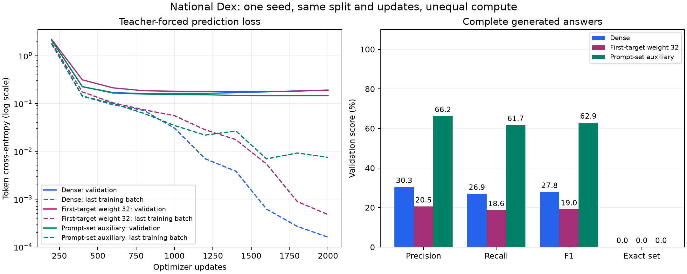

# Lesson 5: changing what the model is rewarded for learning

**2026-09-24.** [Lesson 4](04-first-quality-campaign.md) found that the model could
continue familiar answer lists while answering new queries poorly. This iteration
changes the training signal, with the same data and decoder. We recorded the
[experiment plan](../experiments/2026-09-24-prompt-objectives-plan.md) before training.

## Experiment A: increase the importance of the first decision

Let `ell(q,t) = -log P(correct token | preceding tokens)` for a supervised token.
The ordinary loss averages these values, giving first-target positions only
0.77% of the weight in our validation corpus. We introduce a weight alpha:

```text
L_weighted = (alpha * sum(first-target losses) + sum(remaining losses))
             / (alpha * number_of_first_targets + number_of_remaining_tokens)
```

With alpha=32, those first decisions contribute about 20% of effective token
weight instead of 0.77%. EOS remains an ordinary supervised token. Prompt and
padding remain ignored. We identify each row's first supervised target from
the label mask; no second causal shift is introduced.

The denominator matters: multiplying the first losses without normalizing would
also change overall gradient scale. We want to change relative priorities.
Our tests check both the numerical loss and its gradients against a small,
manually specified example.

This adds no new information. It asks the model to work harder on information
it already had. If it memorizes training queries more confidently, held-out
queries may become worse. That is a falsifiable hypothesis, not a guaranteed fix.

## Experiment B: supervise the entire relation from the prompt

At ANSWER, ask a second question during training: "Which products belong in the
answer set?" This is **multi-label classification**. Many products may be
positive for a query, unlike next-token classification where one next token is
the target at that position.

Define a binary vector y with one position per product. `y_j=1` when product j
occurs among that training record's target labels and zero otherwise. Hidden
attribute nodes remain hidden; no new graph facts, numbers or protocol tokens
are supplied to the model. Labels are derived from the same training answers.

The auxiliary head reuses the model's entity embeddings:

```text
Final hidden states H:              [B, T, 256]
ANSWER state h = H[:,4,:]:          [B, 256]
Learned projection W:               [256, 256]
Projected prompt u = h @ W.T:       [B, 256]
Product embedding rows E:           [1025, 256]
Membership logits z = u @ E.T:      [B, 1025]
Binary training targets y:          [B, 1025]
```

The score for product j is the dot product between a transformed query vector
and that product's embedding. Sharing E matters: an entity receives relational
gradients when it appears as an answer, as well as when it appears as a subject.
An independent output table would not create that same direct connection.

This adds `256*256 = 65,536` projection parameters, about 1% of the dense model's
6,558,720 parameters. We initialize it after the reference stack so the same
seed gives identical initial values for all common parameters.

The ordinary next-token head remains separate. We do not force its softmax to
assign equal probability to every set member, nor do we use auxiliary predictions
to filter generated IDs in this experiment.

## Binary loss and class imbalance

Most products are not members of any particular answer. An unbalanced objective
can reward predicting almost everything as negative. Instead, each query gives
equal total weight to its positives and negatives:

```text
softplus(a) = log(1 + exp(a))

L_set(q) = 0.5 * mean(softplus(-z_j), j in correct products)
         + 0.5 * mean(softplus( z_j), j in other products)

L_total = L_token + lambda * mean_q L_set(q)
```

Positive loss decreases when a positive product's score rises; negative loss
decreases when a negative score falls. We compute these operations in FP32 for
numerical stability, even though the training forward pass uses BF16 autocast.
Our candidate uses lambda=1 with the ordinary, unweighted token loss. The two
experiments are separate; we do not combine both modifications and then guess
which one caused a change.

Control tokens, EOS and padding are not products. Repeated target IDs create
only one positive entry. The objective rejects a query without positive or
negative products. The v1 corpus has nonempty targets and excludes the subject,
so both classes are present.

Balancing classes changes how scores relate to class prevalence. A sigmoid score
is not automatically a calibrated real-world probability. The diagnostic uses
a declared zero-logit threshold (sigmoid 0.5), without tuning it on final test.

## Why this does not leak the answer into the prompt

Teacher-forced training inputs contain the whole correct sequence, but causal
attention blocks position 4 from seeing later positions. The set head reads only
that position. We verify this with two checks:

1. Changing every future answer token leaves set logits unchanged; a prompt-only
   forward pass gives the same set logits.
2. Backpropagating set loss produces no gradient through the future input-token
   activations. It does produce gradients through prompt activations.

Targets necessarily affect gradients through the loss—that is supervision.
Seeing target tokens as input while making the prediction would be leakage.
The shared embedding table receives target-side gradients, but the forward
prediction still depends only on the prompt and learned parameters.

Tests also verify unchanged reference initialization/logits, positive/negative
gradient directions, duplicate handling, and exact checkpoint resume with the
new objective. The toy overfit gate uses real banded product IDs for this mode.

## Reading the training diagnostics

After the same 2,000 updates, first-target validation CE is:

| Training objective | First-target validation CE |
| --- | ---: |
| Original dense | 5.7678, measured in FP32 diagnostic |
| First-target weight 32 | 7.0647, BF16 validation |
| Prompt-set auxiliary | 2.6946, BF16 validation |

These validation modes differ slightly in numerical precision, so do not
interpret tiny differences. The large changes are the useful observations.
Reweighting alone made the held-out first decision worse. The set objective
improved this diagnostic, while ordinary token validation CE ended at 0.1467.

The auxiliary classifier itself achieves 65.45% macro F1, MAP 0.7013, and zero
exact sets on the 222 validation prompts. It includes the subject in 77.48% of
predicted sets at the fixed threshold. That is a real limitation, not something
we silently remove with the known oracle answers. Its report is explicitly
classifier evidence, not evidence of autoregressive generation quality.

Do not compare total training losses across these candidates as if they had
the same objective. We separately log ordinary token CE, first-target CE and
set loss. The decisive comparison remains complete generated answers.

## The full-generation result



The [raw-generation comparison](../experiments/2026-09-24-prompt-objectives.json)
contains the input report hashes, checkpoint identities and per-query failures.
All three models use the same 222 validation queries and final 2,000-update
checkpoints. The auxiliary scores are not used to filter or choose generated IDs.

| Objective | Raw precision | Raw recall | Raw F1 | Raw exact sets |
| --- | ---: | ---: | ---: | ---: |
| Original dense | 30.35% | 26.91% | 27.84% | 0/222 |
| First-target weight 32 | 20.46% | 18.63% | 19.01% | 0/222 |
| Prompt-set auxiliary | 66.21% | 61.67% | 62.90% | 0/222 |

All three terminate with EOS on all validation queries. Reweighting alone hurts
generation here; it is not retained as an improvement. The auxiliary objective
improves F1 by 35.06 percentage points, with about 1% more parameters. This is
substantial single-run evidence, not a multi-seed robustness result or oracle
parity. Aux-model F1 is 70.55% for COLOR and 56.28% for TYPE; the multi-type
dimension remains harder in this run.

The [standalone set-classifier summary](../experiments/2026-09-24-promptset-classifier.json)
is kept separate. Its 65.45% F1 is a different prediction path from the 62.90%
autoregressive result, and must not be substituted for it.

## A known rule belongs in deterministic code

Why are there still zero exact sets? Many answers include the query's own
subject. SAME excludes it by definition, and the parser already knows the
subject. Removing it requires no learned relationship knowledge or oracle lookup.

We implemented the planned post-processing boundary:

```text
parsed model IDs
    -> exclude the SAME subject
    -> apply request IGNORE keys
    -> remove duplicates, keeping first occurrence order
    -> apply an optional return limit
    -> hydrate remaining IDs
```

IGNORE and counts remain request metadata, never model tokens. Filters can yield
an empty result. Post-processing does not invent EOS, complete truncated output,
add missing products, reorder answers or use TYPE/COLOR facts. Every removal is
counted, and the original model response remains available.

The [secondary policy evaluation](../experiments/2026-09-24-postprocessing.json)
replays exactly the same rule on archived outputs from all candidates, with no
IGNORE keys and no return limit:

| Model | Post-processed F1 | Exact sets | Exact sequences |
| --- | ---: | ---: | ---: |
| Original dense | 27.95% | 42/222 (18.92%) | 42/222 |
| Four-expert MoE | 28.07% | 38/222 (17.12%) | 38/222 |
| First-target weight 32 | 19.09% | 27/222 (12.16%) | 27/222 |
| Prompt-set auxiliary | 63.19% | 105/222 (47.30%) | 105/222 |

The large change in exact-set accuracy comes with a small F1 change because
removing one wrong member can turn a nearly correct set into an exact set. This
illustrates how metrics answer different questions. Applying the policy to the
baseline too prevents us from attributing its benefit solely to the new training
objective. The unfinished MoE response stays unfinished in the replay.

This is a tested post-processing component and offline replay, not an HTTP
serving benchmark. The broader service integration remains future work.

## What we know, and what still needs testing

The new supervision helps this decoder use the prompt to generate more relevant
IDs. It does not eliminate wrong relationships, missing products or all other
quality failures. More than half of validation queries still fail exact-set
accuracy after the known rules. The final test remains untouched.

Next priorities are to repeat this candidate across seeds, inspect the remaining
TYPE/COLOR errors and checkpoint selection, and connect the verified generation,
post-processing and hydration pieces into the native service. Keep raw model
quality and processed output quality visible throughout. These measurements do
not establish throughput, energy savings or readiness to replace the oracle.
