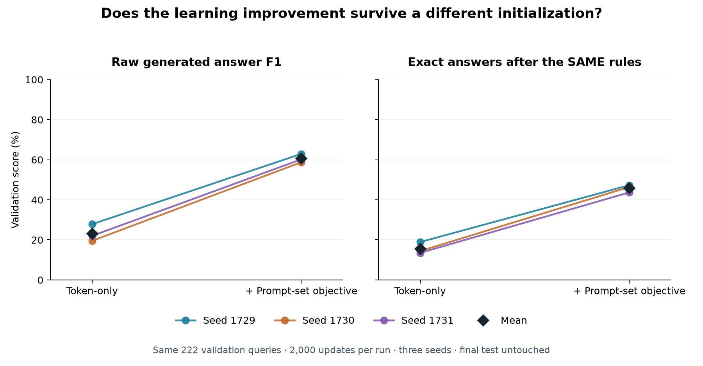

# Lesson 6: does the improvement survive a different starting point?

**2026-09-24.** [Lesson 5](05-prompt-supervision.md) improved answer quality by
changing the training objective. This lesson checks whether that result depends
on a lucky initialization. The [replication plan](../experiments/2026-09-24-seed-replication-plan.md)
was recorded before starting the extra runs.

**Result:** the gain repeats in all three seeds. Mean raw F1 increases from
23.13% to 60.62%; mean exact-answer accuracy after the same deterministic rules
increases from 15.62% to 45.80%. This is progress on a fixed validation split,
with substantial remaining errors.



## All results, including the weaker seeds

| Seed | Dense raw F1 | Prompt-set raw F1 | Dense processed exact | Prompt-set processed exact |
| --- | ---: | ---: | ---: | ---: |
| 1729 | 27.84% | 62.90% | 42/222 (18.92%) | 105/222 (47.30%) |
| 1730 | 19.54% | 58.75% | 32/222 (14.41%) | 103/222 (46.40%) |
| 1731 | 22.01% | 60.20% | 30/222 (13.51%) | 97/222 (43.69%) |

Across seeds, mean +/- **sample SD** is 23.13 +/- 4.26 percentage points for dense
raw F1 and 60.62 +/- 2.11 for prompt-set raw F1. The mean paired F1 improvement
is 37.49 percentage points, with sample SD 2.16 points. For processed exact
accuracy the mean paired gain is 30.18 points, with sample SD 1.80 points.
These are descriptions of three runs, not confidence intervals.

Every run generated syntactically valid, EOS-terminated responses on all 222
queries. Every run still had **zero raw exact answers**. The exact-answer columns
above apply the declared subject-exclusion/deduplication rules to both models;
they must not be relabeled as raw model accuracy. No IGNORE keys or return limits
were supplied. The [audited summary](../experiments/2026-09-24-seed-replication.json)
contains per-seed, per-dimension metrics, source differences and input hashes.

## Where the remaining errors concentrate

The prompt-set model answers 61 queries exactly in **every** seed and 137 in
**at least one** seed. The other 85 queries never receive an exact answer in
these three runs: 72 TYPE and 13 COLOR. The dense model has only five queries
correct in every seed and 70 correct in at least one.

For the prompt-set model, mean raw F1 is 54.79% on TYPE and 67.35% on COLOR.
Mean processed exact accuracy is 27.17% and 67.31%, respectively. This identifies
TYPE as the larger remaining problem; it does not establish its cause. The
"correct in at least one" count is a diagnostic, not an ensemble result: we
cannot choose the correct seed's answer at serving time using oracle labels.

The candidate is worth retaining for further development, but none of these
results establishes oracle parity, generalization to a new split, final-test
performance, or a serving advantage. Equal updates also do not mean equal
compute: the auxiliary objective adds work per update.

## A seed chooses a starting point, not the correct answer

Most trainable weight tensors start with random values. For example, our input
embedding table is `[2049,256]`: one row per vocabulary index, including reserved
indices, and 256 coordinates per row. Product rows occupy `[1025,256]` within
that table. The model must learn useful geometry from the training examples.

The seed chooses the pseudorandom sequence used to initialize those values.
Changing it changes the starting point of optimization, even though shapes,
data and loss equations stay the same. Linear/embedding weights use a normal
initialization with standard deviation 0.02; normalization weights have their
own initialization. A seed does not change which answers the oracle requires.

For each seed s, we train two models:

```text
Shared initial parameters: theta_0(s) = initialize(seed=s)

Dense objective:           L_dense = L_token
Prompt-set objective:      L_aux   = L_token + L_set

Shared-parameter gradient:
    dense: grad_theta L_token
    aux:   grad_theta L_token + grad_theta L_set
```

The optional set projection adds `[256,256]` parameters, initialized after the
common decoder. Tests verify that the common initial tensors and initial token
logits are identical within each seed pair. During training, the additional
gradient changes their trajectories. The token head still generates the answers;
we do not substitute the set classifier at evaluation time.

In these recipes dropout is zero and batches are sequential, without shuffling.
The main seeded difference is therefore initialization. GPU execution remains
`deterministic=false`, so we are not claiming bit-for-bit repeatability from a
seed alone. Changing the data-order policy would be another experiment.

## Two seeds with different jobs

`seed` controls model/training randomness. `data.split_seed` decides which
complete queries belong to training, validation and final test. We vary the first
and hold the second at 1729. Thus all six runs use exactly the same 222 validation
questions and the same 1,637 training queries. The protected 191 test queries
remain unused for scoring or selection.

Changing both seeds at once would mix initialization variation with exam
difficulty. That may be a useful later study, but it would not isolate the
question we are asking here.

We retain the final checkpoint after 2,000 optimizer updates for every run.
Selecting an earlier checkpoint with validation is a legitimate separate
procedure, but its selection rule must be stated and applied consistently.
We have not selected the best-looking checkpoint separately for each run here.

## Paired comparisons and uncertainty

Let F_dense,s and F_aux,s be the macro F1 scores for one seed. We report both
individual scores and the within-seed improvement:

```text
delta_s = F_aux,s - F_dense,s
mean_delta = sum_s(delta_s) / n

sample_SD(delta) = sqrt(sum_s((delta_s - mean_delta)^2) / (n - 1))
```

The `n-1` denominator defines the sample standard deviation. It describes spread
among the observed seed effects; it is not a confidence interval. We have three
seeds, not 666 independent experiments. The same 222 questions occur in each run,
and even different questions can share many targets and attributes.

A gain on all three seeds is stronger evidence than a gain on one. It still
does not establish robustness to new datasets, new splits, new graph versions
or different training budgets. We report the full spread rather than selecting
the best seed and presenting it as typical.

## Checking that the comparison means what it says

The aggregation script checks actual checkpoint bytes against saved hashes,
saved configuration hashes, training/report identity agreement, source archives,
runtime versions, equal budgets, paired seeds and exact validation query/target
coverage. It recomputes raw metrics from archived responses before summarizing.
The SAME post-policy is applied equally to every run, without adding missing
products or repairing unfinished responses. Raw and processed metrics stay separate.

The original dense run predates the optional-objective implementation. Its source
diff adds the optional head/loss switches and telemetry; neutral defaults retain
the original objective. The original prompt-set run and all new runs have the
same model/training code. Their source archives differ only in the subsequently
added post-processing module and its package exports. The archive comparison is
retained in the report instead of pretending every historical source hash matches.

An incomplete collection with unmatched seeds is rejected. Unit tests also check
the sample-SD calculation and ensure post-processing never turns an unfinished
response into a successful one.

## Reproducing the comparison

Training uses the optional locked Torch environment. For a new unused run name:

```powershell
uv run --no-sync plm train --override +experiment=prompt_set_lab --override seed=1730 --override run_name=my_promptset_1730
uv run --no-sync plm evaluate --checkpoint runs/my_promptset_1730/checkpoint-final.pt --override +experiment=prompt_set_lab --override seed=1730 --override run_name=my_promptset_1730 --out runs/learning/my_promptset_1730.json
```

Use `+experiment=national_dex_v1` for its dense comparator. Reports and completed
run names are protected from overwrite. Neither command accesses final-test
metrics. The replication summary accepts repeated `--report dense=<path>` and
`--report promptset=<path>` arguments, pairing them by the seed saved in each run.

## The next two questions

On quality, inspect the 85 consistently failing queries and evaluate a declared
checkpoint-selection or training change using validation only. Keep the final
test for a selected procedure, rather than using it as another tuning dataset.

On systems, the current decoder reruns the entire prefix at every generation
step. A KV cache would store attention keys/values from earlier tokens. That
should reduce repeated inference work without changing the learned parameters.
It needs its own numerical-equivalence, generated-output and latency checks;
faster generation would not itself fix the relation errors above.

Self-checks: Why hold the split seed fixed? Why pair runs before calculating the
spread of improvements? Why is "one seed gets each query right" insufficient to
claim a correct deployed ensemble? How could an inference optimization be
successful even if F1 does not change?
