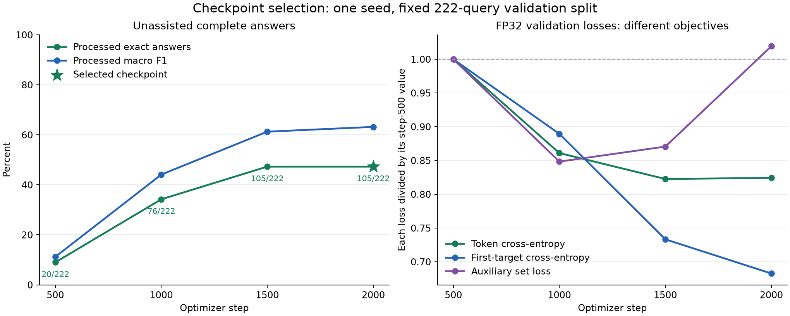

# Lesson 10: choosing weights by the behavior we need

**2026-09-24.** A training run visits many parameter settings, not just the final
one. We saved weights at steps 500, 1000, 1500 and 2000. This comparison evaluates
those existing weights on complete, unassisted validation answers. It does not
train another model or use the oracle hint from Lesson 9.

The [selection plan](../experiments/2026-09-24-checkpoint-selection-plan.md) fixes
the candidates, decoding settings and decision rule before measuring generation.
This is an exploratory comparison within seed 1729; the earlier three-seed
final-checkpoint study remains a separate experiment.

**Result: retain step 2000.** It ties step 1500 on processed exact answers and
wins the declared F1 tie-breaker. None of these earlier snapshots improves the
selected outcome. This is useful negative evidence against this particular
early-stopping remedy; it does not rule out other training schedules or checkpoints.

## Measured comparison



The [portable report](../experiments/2026-09-24-checkpoint-selection.json) binds
each raw report and checkpoint by hash. All 888 generated responses (four times
222) terminate validly. All raw exact-set counts are zero; the existing policy
removes self-returns and duplicates without adding relationship information.

| Step | Raw F1 | Processed F1 | Processed exact | TYPE exact | COLOR exact |
| --- | ---: | ---: | ---: | ---: | ---: |
| 500 | 11.17% | 11.20% | 20/222 | 6/119 | 14/103 |
| 1000 | 43.93% | 44.11% | 76/222 | 19/119 | 57/103 |
| 1500 | 61.00% | 61.27% | 105/222 | 33/119 | 72/103 |
| **2000** | **62.90%** | **63.19%** | **105/222** | **32/119** | **73/103** |

The tie in exact count hides changes in individual queries: steps 1500 and 2000
share 98 exact answers. The final checkpoint loses seven earlier successes and
gains seven others. TYPE drops by one exact answer while COLOR gains one. Our
declared aggregate rule selects step 2000; this is not uniform improvement on
every query or dimension.

The final checkpoint reproduced all 222 archived raw responses exactly. Its
selection therefore keeps the existing anchor and leaves service quality unchanged.

| Step | Token CE | First-target CE | Auxiliary set loss |
| --- | ---: | ---: | ---: |
| 500 | 0.177973 | 3.944386 | 0.690205 |
| 1000 | 0.153243 | 3.508792 | **0.585584** |
| 1500 | **0.146419** | 2.892515 | 0.600939 |
| 2000 | 0.146702 | **2.692895** | 0.703523 |

Different losses favor different checkpoints. Selecting the minimum set loss
would choose step 1000 and only 76 exact answers. Selecting the minimum token CE
would choose step 1500, which ties exact count but has lower F1. The figure's
right panel divides each loss by its own step-500 value to show its trajectory;
the vertical values there are ratios, not absolute losses or comparable loss scales.

The historical set-loss upturn was a reasonable lead. This direct comparison
shows why that lead was insufficient to choose an earlier checkpoint.

## Why the last checkpoint is not automatically best

An optimizer repeatedly updates parameters, written schematically as:

```text
theta_(s+1) = theta_s - learning_rate_s * update_direction_s
```

Here `s` counts optimizer steps. AdamW's update direction depends on gradient
moments and weight decay, so it is more than the current raw gradient. Lower
training loss means the objective fits training examples better. It does not
guarantee better predictions on held-out queries.

If training loss keeps improving while validation behavior worsens, we may be
seeing **overfitting**. One remedy is **early stopping**: stop training using a
declared validation rule and retain suitable weights. Our experiment instead
inspects snapshots of a run that has already finished. Selecting an earlier
snapshot does not undo the compute already spent; we cannot claim energy savings
from this retrospective comparison.

## The loss is a guide, not the application requirement

Our training objective combines two kinds of supervision:

```text
L_total = L_token + lambda * L_set       lambda = 1 here
L_token = mean over supervised tokens of -log P(correct next token)
L_set   = mean over queries of balanced binary membership loss
```

Token cross-entropy, first-target cross-entropy and set loss can move in different
directions. They supervise related but distinct behavior. Set loss uses a
different prediction head; a worsening value need not imply worse autoregressive
generation. Long lists also contribute more tokens to token CE, while our
complete-answer metrics give each query equal weight.

Cross-entropy is also sensitive to confidence. For a correct class with assigned
probability `p`, its penalty is `-log(p)`: about 0.69 at `p=0.5`, but 6.91 at
`p=0.001`. A few increasingly confident errors can raise average loss even while
more other predictions become correct. This is a possible mechanism, not a
diagnosis of our run without examining the scores. Comparing the auxiliary head's
loss to the decoder's answers adds another difference: they are separate heads.

For a teacher-forced batch, logits have shape `[B, T, 2049]`. We compare
`logits[:, :-1, :]` with `labels[:, 1:]`, ignore prompt/padding labels and weight
the batch's mean token CE by its number of valid target tokens. First-target and
set losses are averaged by query count. All checkpoints use FP32 inference in
this comparison; the historical training log used BF16 autocast.

## The declared rule

First require every generated response to reach EOS with valid protocol syntax.
Then choose the checkpoint by these priorities:

1. Highest processed exact-set accuracy.
2. If tied, highest processed macro F1.
3. If still tied, the earlier training step.

In Python notation, eligible candidates are ranked by:

```python
(processed_exact_accuracy, processed_f1, -step)
```

This is **lexicographic selection**: an improvement in the first field takes
priority over the second. It is not a weighted average. We choose exact answers
first because returning an entire correct product set is the application goal;
F1 recognizes partial correctness when exact counts tie. Every candidate's raw
metrics and TYPE/COLOR breakdown remain visible, including ineligible candidates.

The existing post-policy removes the SAME subject and repeated IDs. It cannot
use hidden graph attributes to fix a relationship, add missing products or turn
truncation into successful completion. No caller IGNORE list or limit is applied.

## Selection spends information from validation

Suppose four candidates each have a noisy validation estimate. Choosing the
largest estimate tends to favor both real improvement and favorable noise.
Consequently, the winning validation result is not an untouched estimate of
future performance. Our candidates also share a training trajectory and the
same queries, so they are not independent experiments.

This sweep was motivated by earlier validation findings. Declaring its rule
before these measurements makes the local comparison reviewable; it does not
erase the broader adaptive history. We keep the final test reserved until the
model and selection procedure are settled. A within-seed winner also does not
establish that the same checkpoint step wins across random initializations.

## Reproducibility checks

The shared inference loader verifies data, vocabulary, split, objective, model
configuration and checkpoint identity. It checks each checkpoint's sidecar
against its authoritative payload. All four use the same 222 queries, cached
greedy protocol masking, 507-token completion bound and FP32 model execution.

The final checkpoint must reproduce every archived raw response exactly before
we accept the sweep. Source/input hashes, resolved evaluation configuration,
full responses and an exact copy of the analysis script accompany the
per-checkpoint reports. Unit tests
guard priority order, validity eligibility, tie-breaking and rejection of missing,
duplicate or non-finite candidate evidence.
