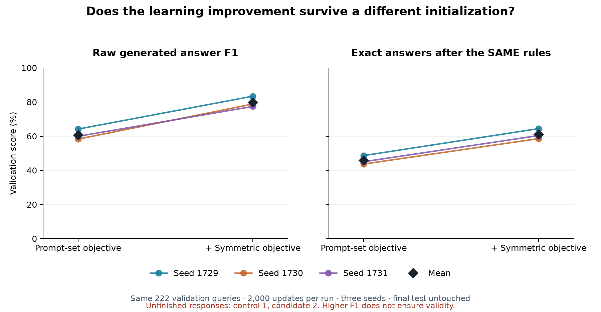
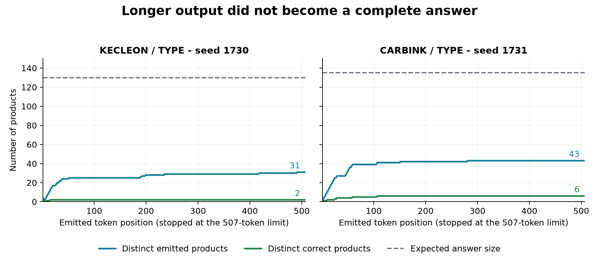

# Lesson 12: replication, controls and a serving reference

**2026-09-24.** The symmetric relation objective improved seed 1729. This
experiment repeats the same configuration at seeds 1730 and 1731, then compares
each against a fresh prompt-set control trained with that same seed. The
[declared plan](../experiments/2026-09-24-symmetric-replication-plan.md) fixes the
training budget, decoder, comparison and conditional HTTP verification.

## Result: quality improves in every pair; promotion is withheld

All six runs completed 2,000 optimizer updates and were evaluated on the same
222 validation queries. Training source contents match across all six archives.
Both variants use prompt-set loss weight one; the candidate additionally uses
symmetric loss weight one. Each exact-answer count below is out of 222, after
the same subject-exclusion/deduplication policy. Invalid responses stay invalid.

| Seed | Control raw F1 | Symmetric raw F1 | Control exact | Symmetric exact | Unfinished: control / symmetric |
| --- | ---: | ---: | ---: | ---: | ---: |
| 1729 | 64.14% | 83.41% | 108 | 143 | 0 / 0 |
| 1730 | 58.27% | 78.82% | 97 | 130 | 0 / 1 |
| 1731 | 59.93% | 77.39% | 100 | 134 | 1 / 1 |

| Metric | Prompt-set control: mean ± sample SD | + Symmetric objective: mean ± sample SD |
| --- | ---: | ---: |
| Raw generated F1 | 60.78% ± 3.03 pp | 79.87% ± 3.15 pp |
| Processed F1 | 61.06% ± 3.06 pp | 80.25% ± 3.16 pp |
| Processed exact-answer accuracy | 45.80% ± 2.56 pp | 61.11% ± 3.00 pp |

`pp` means percentage points. Paired exact-answer improvements are **35, 33
and 34 additional correct answers**, averaging +15.32 percentage points
(paired sample SD 0.45 pp). Processed F1 improves in every pair too, averaging
+19.19 pp (paired sample SD 1.56 pp). Raw exact-answer accuracy remains zero.



The quality improvement repeats in these three initializations. It does not
satisfy the separate validity requirement: the controls have one unfinished
response and the candidates have two. The refreshed control's failure is
`PKM_AERODACTYL / TYPE`, seed 1731: 507 emitted IDs, 49 distinct, no EOS.
Thus termination failure occurs with both objectives; these runs do not isolate
the symmetric objective as its cause. The existing serving reference is retained.

**Remaining quality gap:** 55 validation queries are never exact in any
symmetric seed: 52 TYPE and 3 COLOR. The refreshed controls have 84 never-exact
queries (71 TYPE, 13 COLOR). The number correct in every seed rises from 58 to
99. The individual TYPE exact counts improve 32→52, 33→50 and 30→48; COLOR
counts improve 76→91, 64→80 and 70→86. Oracle parity remains unachieved.

The [portable report](../experiments/2026-09-24-symmetric-replication.json)
contains run/checkpoint identities, recomputed metrics, sample statistics,
source comparisons, failure lists and the promotion decision. The
[control audit](../experiments/2026-09-24-symmetric-control-audit.json) preserves
the replay investigation described below. Final test was not evaluated.

## What a paired seed comparison controls

A seed initializes the random number generators. It controls initialization and
random draws, but does not guarantee identical GPU calculations or a particular
model quality. One run can start in a more favorable part of parameter space
than another. These campaigns explicitly use `deterministic: false`.

For each seed s, compare the two objectives under the same training setup:

```text
delta_s = score(symmetric model, seed s) - score(prompt-set model, seed s)
mean_delta = (delta_1729 + delta_1730 + delta_1731) / 3
```

Common parameters are initialized identically for the same seed; the new
projection is initialized afterward. The training data order, split, optimizer,
schedule and final 2,000-step checkpoint rule stay fixed. The extra objective
changes gradients, parameters and computation, so this is not equal-compute
training even though the step budgets match.

The dataset split seed remains 1729 in all runs. We are measuring sensitivity
to initialization on one fixed split, not robustness across datasets or query
partitions. Held-out subject/dimension queries can contain products already seen
elsewhere in training. This is not unseen-product generalization.

## Mean, variation and the limits of three runs

For three scores x_s, sample standard deviation is:

```text
sample_SD = sqrt(sum_s (x_s - mean(x))**2 / (3 - 1))
```

It describes observed variation across these initializations. It is not a
confidence interval for all future datasets or a proof that every future seed
will improve. We show the individual pairs as well as the mean so a strong seed
cannot hide a regression in another one. The direction of subtraction is tested:
positive differences always mean the candidate scored higher than its reference.

Exact-answer accuracy remains strict: one missing product makes a set incorrect.
Macro F1 gives every query equal weight but allows partial credit within a set.
We report both, plus TYPE/COLOR and queries never exact across the candidate seeds.

## Why the controls need auditing too

The baseline reports were generated earlier in the project. We verify checkpoint
hashes, source archives, completed budgets, run/config identity, runtime versions,
data/split hashes and exact validation-query coverage. Replaying the deterministic
policy recomputes each metric from stored responses rather than trusting a table.

Normalized configurations may differ only in seed, run name and the declared
symmetric-loss coefficient. Both variants keep prompt-set weight one. The same
uncached constrained greedy decoder is used for this replication to match the
archived controls. Seed 1729 also checks full response parity against the earlier
cached candidate run. This is a correctness control, not a timing comparison.

A fresh seed-1729 control replay **failed to reproduce the archived weights
bitwise**: normalized configurations match, but none of the 92 saved model
tensors is identical. This does not mean every scalar weight differs. It means
every tensor contains at least one difference. Code history and nondeterministic
GPU execution are possible factors; this experiment has not isolated the cause.

We then checked a fixed batch of four training records, padded to 178 positions:

```text
input_ids, labels, attention_mask: [4, 178]
logits:                            [4, 178, 2049]
loss:                              scalar
gradient for each parameter W:     same shape as W
```

Both implementations loaded exactly the same archived weights. CPU FP32 logits,
losses and all available parameter gradients matched bitwise: 95 checked
tensors. In notation, the gradient is dL/dW: the local effect of a weight change
on the training objective. Matching it checks backward computation as well as
predictions. This is a bounded regression check, not proof that 2,000 CUDA
optimizer steps must follow the same trajectory. Floating-point addition is
not associative: `(a + b) + c` can differ from `a + (b + c)` after rounding.
For example, float32 arithmetic with `a=100000000`, `b=-100000000`, `c=1`
gives `1` in the first grouping and `0` in the second. A random seed does not
control the order in which a parallel kernel adds floating-point values.

The plan was amended **before evaluating refreshed control generation quality**:
train all three controls on the current source and preserve the failed replay.
The primary comparison now requires identical source contents in all six
training archives. This removes code history as a between-variant difference;
three seeds still cannot measure every source of training variability.

## Why the candidate did not become the serving reference

The plan would retain the already established symmetric seed-1729 final
checkpoint only if the improvement repeated and **all three candidate runs
produced valid, terminated responses**. It would not choose whichever new seed
happened to obtain the highest score. That validity gate failed:

| Seed | Failed query | Expected products | Emitted IDs | Distinct IDs | Ended with EOS? |
| --- | --- | ---: | ---: | ---: | --- |
| 1730 | `PKM_KECLEON / TYPE` | 130 | 507 | 31 | No |
| 1731 | `PKM_CARBINK / TYPE` | 135 | 507 | 43 | No |

Both exhausted the fixed 507-token completion budget. The final 227 tokens of
the CARBINK answer are all `PKM_WIGLETT`. KECLEON's final 17 are all
`PKM_TOXICROAK`, with repetitions earlier too. These are observed repetitions,
not merely valid answers that needed a slightly larger length allowance. Each
sequence already selected a non-answer product at its second emitted ID,
excluding the subject itself from this particular error count.



The plateau means extra emitted tokens mostly repeat existing choices. In these
two cases only 2 and 6 distinct emitted products belong to the expected answer.
The dashed line is an oracle answer count shown for diagnosis; it is not supplied
to the decoder as a stopping instruction.

An autoregressive decoder feeds each chosen token into the next step:

```text
x_(t+1) = argmax_token p(token | prompt, x_1, ..., x_t)
```

A repeated choice becomes part of the next input. Training on correct prefixes
does not automatically teach recovery from these self-produced prefixes. That
is a plausible mechanism to investigate, not an isolated causal finding here.
The symmetric head encourages relational representations; it does not directly
enforce unique generated products, canonical order or EOS.

An exploratory follow-up checked that head on the exact two failed queries,
using its existing zero-logit threshold and excluding the subject:

| Query / seed | Correct membership predictions | Extra products | Missing products | Membership F1 |
| --- | ---: | ---: | ---: | ---: |
| KECLEON / 1730 | 130 | 1 | 0 | 99.62% |
| CARBINK / 1731 | 132 | 12 | 3 | 94.62% |

For KECLEON, the classifier nearly identifies the entire answer while generation
finds only two correct products and fails to stop. This directly demonstrates a
gap between the two output paths on that query. It does not mean the decoder
can access a perfect answer list: the classifier still has an extra product,
and its logits are not used by the generation code. CARBINK also has substantive
membership errors. Neither classifier result counts as a generated answer.

The classifier produces one score for each entity at once, `[batch, 1025]`.
The decoder produces `[batch, sequence_length, 2049]` logits and selects the last
position for the next token. Sharing embeddings lets their training gradients
interact, but does not make the two prediction procedures equivalent.

The parser correctly marks the two outputs invalid. Policy replay does not
deduplicate an unfinished sequence into an apparently successful response.
Exact-answer metrics require valid termination, and duplicate emissions also
reduce raw precision. The native API's existing behavior for invalid generation
is an error, so silently accepting these cases would change the serving contract.

**Decision:** keep the existing prompt-set serving reference. The conditional
HTTP promotion campaign was not run, and the quickstart checkpoint was not
changed. The next experiment should investigate repetition and termination
while preserving the original reports and separately measuring any new decoding
policy. A stronger average score cannot waive a predeclared validity requirement.

A research reference is a concrete checkpoint/configuration to compare against
next. It is not an oracle-equivalent release or evidence of concurrency, energy
or Linux/vLLM performance. The ordinary model defaults remain conservative, the
HTTP example selects its experiment explicitly, and final test remains reserved.

## A small calculation to check your understanding

For the KECLEON membership classifier, `TP=130`, `FP=1`, `FN=0`:

```text
precision = TP / (TP + FP)           = 130 / 131 = 99.24%
recall    = TP / (TP + FN)           = 130 / 130 = 100%
F1        = 2*TP / (2*TP + FP + FN) = 260 / 261 = 99.62%
exact set = (FP == 0 and FN == 0)   = False
```

That single extra product is almost invisible in F1 but decisive for exact
correctness. Now contrast this with the failed generated answer: 507 emitted
IDs, only two distinct correct products, and no EOS. It fails both answer
quality and completion, despite sharing embeddings with that strong classifier.
