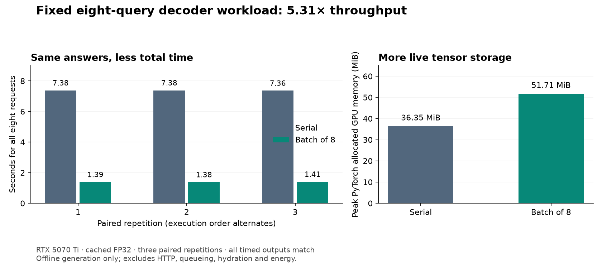

# Lesson 14: batching independent answers

**2026-09-24.** Complete-answer evaluation has been slow because the decoder
handles one query at a time. This change groups independent queries into a
single model call. The weights, token-selection policy and expected answers stay
fixed. The [declared experiment](../experiments/2026-09-24-batched-evaluation-plan.md)
requires full output parity before measuring speed.

## What becomes parallel

Autoregressive generation still depends on its previous choices. Batching does
not let one answer jump ahead to an unknown future token. It lets several
answers take their next step together:

```text
                           Serial          Batch of eight
Initial prompt IDs         [1, 5]          [8, 5]
Later input IDs            [1, 1]          [8, 1]
Next-position logits       [1, 2049]       [8, 2049]
```

For the output projection, the computation is:

```text
logit[b, v] = sum_d hidden[b, d] * output_weight[v, d]
```

The sum is over feature dimension d, not batch dimension b. Each query gets its
own score vector. Attention also stays within each query's history. Sharing a
model call does not make the queries attend to one another.

The current checkpoints have width 256, eight attention heads and two KV heads,
so each head has 32 features. A layer's key or value cache has shape:

```text
[B, 2, cached_positions, 32]
```

There are eight layers and both a key and a value cache per layer. Batching
shares the model weights but increases cache and intermediate-tensor storage.
This is one reason throughput and memory must be measured together.

## Different answers finish at different times

All prompts have five tokens, so every row starts at the same cache position.
After that, one row might emit EOS after 75 generated tokens while another needs
219. The implementation keeps the entire fixed group until its last active row
finishes or reaches the bound.

Once a row emits EOS, we stop adding tokens to its returned answer. Its tensor
slot receives ignored EOS inputs in later calls so the batch stays rectangular.
Those dummy inputs are not generated answer tokens and are never returned.
The active rows keep their ordinary histories and absolute RoPE positions.

The loop maintains:

- A completion flag for each row.
- A separate set of previously emitted targets for each row when uniqueness is enabled.
- One grouped KV cache, with independent rows and a shared position counter.
- An ordered list of returned sequences, including repeated input queries.

Finishing one answer must not stop the others or contaminate their masks.
Tests cover mixed lengths, duplicated/reordered queries, a still-truncated row,
and even nonfinite dummy outputs from an already finished row. Active nonfinite
outputs and malformed tensor shapes are rejected.

This implementation spends work on finished slots. **Continuous batching** would
admit new requests or reorganize active rows as work finishes; that scheduler
and its cache-management requirements are not implemented here.

## A separate path with explicit configuration

`generate_responses` handles a fixed group. The existing `generate_response`
remains the serial reference. They share result parsing so EOS, syntax errors
and truncated responses retain one interpretation.

The evaluator accepts:

```powershell
--override eval.use_kv_cache=true --override eval.generation_batch_size=8
```

Larger groups require protocol constraints and KV caching. The default is one.
Reports record the batch size and append `+batch-v1` to the decoder identifier.
The last group can be smaller: 222 queries produce 27 full groups and one group
of six. Input ordering stays intact when the results are assembled.

This is an offline evaluation option. Native HTTP serving rejects batch sizes
above one, since its current scheduler handles requests serially. Accepting the
option there would imply behavior it does not provide.

## Why mathematical independence still needs a parity check

Different matrix shapes can cause a numerical library to choose different
kernels or reduction groupings. Floating-point results can differ slightly;
argmax may change if two token scores are close. We therefore compare complete
answers, not just approximately equal logits or aggregate F1.

The campaign checks all 1,332 saved serial responses: 222 validation queries,
three frozen symmetric checkpoints, and both original and unique-target policies.
It compares full token sequences, termination, validity, errors and metrics.
The model source, checkpoint, corpus, split and runtime identities are checked.
Original unfinished answers must remain unfinished under the same original
policy; batching is not allowed to hide their failures.

This establishes parity only for the tested checkpoints, queries, runtime and
batch size. A future model or batch shape still needs appropriately scoped
verification. The protected final-test partition is not used.

## Timing throughput without inventing a latency claim

After parity, the benchmark uses the fixed first eight seed-1729 validation
queries under the original policy. Both paths use cached FP32 inference. Each
path gets a complete warmup, followed by three paired repetitions with
alternating order. CUDA is synchronized around the timed region, peak allocated
memory is recorded, and every timed output is checked again.

For eight completed requests in elapsed time t:

```text
throughput = 8 / t                 # requests per second
serial-to-batch ratio = sum(serial times) / sum(batch times)
```

Dividing batch time by eight is a share of the workload cost, not the latency
seen by a caller. The grouped function returns after the group completes.
Request arrival times, queue waits, early-result delivery, HTTP serialization,
hydration and scheduling would need their own service measurements.

Timing runs after the parity campaign, without another launched training or
evaluation process. It measures a decoder workload, not energy, an HTTP SLO,
maximum concurrent users or an advantage over the perfect oracle.

## Verification

**Result: all 1,332 outputs match exactly**, including token IDs, termination,
protocol validity, errors, and raw/processed metrics. This includes the original
policy's two unfinished responses; batching faithfully retains those failures.
Checkpoint hashes, report hashes, archived source and current model source were
checked. The [portable receipt](../experiments/2026-09-24-batched-evaluation.json)
records the environment, identities, six result sets and all timing repetitions.

On the RTX 5070 Ti, with PyTorch 2.11.0+cu128 and FP32 inference:

| Eight-query workload | Serial cached | Batch of eight |
| --- | ---: | ---: |
| Median total time, three repetitions | 7.3799 s | 1.3868 s |
| Throughput computed from median time | 1.084 requests/s | 5.769 requests/s |
| Peak PyTorch allocated GPU memory | 36.35 MiB | 51.71 MiB |

The ratio of summed serial time to summed batch time is **5.3071x**. Individual
paired ratios range from 5.2388x to 5.3623x. All timed outputs match. Three
repetitions on eight fixed queries provide a local measurement, not a general
speed estimate across catalogs, answer lengths, hardware or batch sizes.



Why less than eightfold? The longest answer takes 219 steps. Keeping eight
slots alive produces 8 x 219 = 1,752 output slots, but the real completions total
only 1,150 tokens. Thus 65.64% of those output slots contribute returned tokens.
This is a count of useful slots, **not GPU utilization** or a prediction of
runtime: prefill, kernel efficiency, cache movement and Python overhead also
matter. Different-length answers introduce a **straggler**: the last active row
determines when the group can return.

The measured memory increase is about 15.36 MiB. It includes weights, caches and
temporary tensors tracked by PyTorch's allocator; it does not measure total
device usage or reserved allocator memory. The weights are shared across rows,
so memory does not scale as eight separate loaded models.

For a tensor exercise, calculate one layer's FP32 key-plus-value cache at
219 stored positions and batch size eight:

```text
2 (K and V) * 8 (batch) * 2 (KV heads) * 219 (positions)
  * 32 (head width) * 4 (bytes per FP32 value) = 897,024 bytes
```

Multiply by eight layers for this model. This is a hypothetical cache position,
not a reconstruction of measured peak memory: the real cached position includes
prompt tokens and excludes the last selected token until it is fed back in.
Temporary concatenations and other intermediates also contribute to the peak.

**What this advances:** complete-answer experiments can now use an explicitly
configured, verified batch path. It adds no learned parameters and changes no
answers in this campaign. The symmetric models' mean processed exact accuracy
remains 61.11%; quality and HTTP serving milestones are still open. Next, this
faster evaluator can test whether learned relation scores help the decoder make
its initial choice, with any new decoding rule evaluated as its own experiment.

The full suite passed 207 tests before the real campaign. This includes CLI
output/configuration checks using a trained fixture, parser consistency,
row-local state, mixed completion, invalid inputs, and native rejection of an
offline-only setting. Core imports remain designed to work without Torch;
Torch is imported only when invoking the optional inference implementation.

Continue to [Lesson 15](15-first-target-guidance.md) for the frozen-model
experiment that uses learned relation scores to guide the first emitted target.
