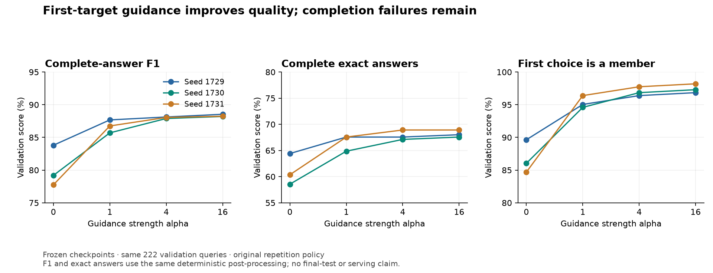

# Lesson 15: asking the learned relation head to guide the first choice

**2026-09-24.** This experiment tests an inference rule on frozen models.
[Lesson 14](14-batched-evaluation.md) made full-answer evaluation faster. Here we
use it to investigate the quality gap: can a learned membership score help an
autoregressive model start its answer in the right relation group?

## Two different questions inside one model

The token head asks: **which token should come next in this sequence?** Its
scores depend on the prompt and previously generated targets. The symmetric
relation head asks: **does this candidate belong with this subject under the
requested dimension?** Its scores depend on learned embeddings and the dimension.
It has no notion of which member should appear first in the serialized list.

These are different objectives. A candidate can be a correct member but appear
at the wrong position. Likewise, choosing the compiler's exact first target
still does not guarantee that all later targets will be generated correctly.
We therefore measure three things separately: membership of the first choice,
exact first-target agreement, and complete-answer quality.

## The scoring intervention

Let l_v be the first-position token logit for product v, and r_v its learned
relation logit. A logit is an unnormalized score: larger values rank higher.
We define:

```text
q_v = sigmoid(r_v) = 1 / (1 + exp(-r_v))
guided_l_v = l_v + alpha * log(q_v)
chosen_token = argmax_v guided_l_v   # after the ordinary legal-token mask
```

Because 0 < q_v < 1, log(q_v) is nonpositive. High membership scores produce
almost no penalty; low membership scores reduce a candidate's token score.
The implementation uses the numerically stable `logsigmoid` operation rather
than explicitly taking a logarithm of a potentially rounded-to-zero sigmoid.

With r = 4, q is about 0.982 and log(q) about -0.018. With r = -4, q is about
0.018 and log(q) about -4.018. At alpha = 4, that second candidate receives
roughly a 16-point penalty. This explains why strength matters: an aggressive
penalty can overcome the sequence model's own ordering preference.

If we wrote a softmax over guided scores, its relative weights would be:

```text
p_guided(v | prompt) proportional to p_token(v | prompt) * q_v ** alpha
```

This resembles multiplying two experts' preferences. It is a heuristic, not a
claim that these heads provide independent, calibrated probabilities. They
share learned parameters; the relation head was trained with a balanced
positive/negative loss, so its sigmoid scores should not automatically be read
as real-world membership frequencies.

## The tensor path

For a group of eight prompts with five tokens each:

```text
prompt IDs                       [8, 5]
cached prefill token logits      [8, 5, 2049]
first-position product logits    [8, 1025]
learned relation logits          [8, 1025]
log-sigmoid penalty              [8, 1025]
```

The first generated token is predicted from position 4, the ANSWER delimiter.
Only `logits[:, -1, 1024:]` receives the penalty. Earlier positions and control,
steering, reserved and EOS columns remain unchanged. The next call receives
one chosen token per row and uses the ordinary KV cache.

The existing model forward computes relation scores from prompt IDs and learned
weights; the wrapper passes no labels. It cannot look up the query's expected
answers. We deliberately reuse that implementation instead of reproducing its
formula in a second place. This incurs another short prompt forward per batch;
the experiment makes no speed claim for the guided path.

A fresh prefill triggers a fresh penalty. Later calls have a cache and receive
no penalty. There is no persistent guidance state between requests. At alpha
zero, the wrapper skips the auxiliary head and returns the original decode
output, enabling an exact baseline replay.

## What this experiment isolates

We test alpha 0, 1, 4 and 16 at all three frozen symmetric checkpoints, on the
same 222 validation queries. This is 2,664 query executions. All use batch size
eight, constrained cached FP32 inference, a 507-token completion bound and the
original repetition policy. No retraining or new parameters are involved.

We do not add a subject mask or a uniqueness constraint. Changing several rules
at once would make any improvement harder to attribute. One known limitation:
the subject column was excluded from the relation training loss, so its guidance
score lacks direct self-membership supervision. We record first-choice
self-returns to expose that behavior.

The [declared plan](../experiments/2026-09-24-first-guidance-plan.md) requires an
exact zero-strength replay before each seed's guided runs. It also defines a
candidate integration gate: all 666 outputs valid and terminated, no per-seed
processed-F1 or exact-set regression, and a strict mean exact-set improvement.
Every strength is reported even if it fails. A passing setting would need
integration and verification before serving promotion.

The validation set has informed many development choices already. These
measurements are development evidence; they do not replace the protected final
test or prove generalization to a new graph. Choosing a useful direction and
proving a final claim are separate stages of the research.

## Results: a better start, with continuation failures still present

All 2,664 executions completed. All 666 zero-strength responses and metrics
replayed exactly. For each setting, the table averages the same validation
queries across seeds 1729, 1730 and 1731:

| Strength | Raw F1 | Processed F1 | Processed exact answers | Exact counts by seed | Valid / terminated |
| --- | ---: | ---: | ---: | --- | ---: |
| 0 | 79.87% | 80.25% | 61.11% | 143 / 130 / 134 | 664/666 |
| 1 | 86.29% | 86.71% | 66.67% | 150 / 144 / 150 | 664/666 |
| 4 | 87.60% | 88.02% | 67.87% | 150 / 149 / 153 | 664/666 |
| 16 | 87.90% | 88.33% | 68.17% | 151 / 150 / 153 | 664/666 |

Every nonzero setting improves aggregate F1 and exact accuracy in every seed.
However, **none passes the declared integration gate**, because the same two
unfinished answers remain. No strength is selected for integration or serving.
The [portable report](../experiments/2026-09-24-first-guidance.json) contains all
settings, first-choice changes, checkpoint/runtime identities and artifact hashes.



At strength 16, the first choice is a correct member in 649/666 executions,
up from 578/666. Exact first-target agreement rises from 443/666 to 490/666.
Those are quite different success rates: knowing a member is easier here than
choosing the right starting point for the ordered answer.

Across the three seeds, strength 16 changes 90 first choices. It repairs 73
nonmember starts but turns two member starts into nonmembers; the other changes
preserve membership status. Every answer with an unchanged first choice remains
identical token for token. This supports the intended causal boundary: later
changes follow a changed history, rather than direct guidance at later positions.

## Gains do not erase individual regressions

Strength 16 gains 48 exact answers and loses one previously exact answer, for a
net gain of 47 across 666 executions. Strength 4 gains 45 and loses none. The
strongest setting has the highest aggregate score in this grid, but this does
not make it uniformly better for individual queries.

For example, at seed 1729, ARMALDO's COLOR query changes its first token from
`PKM_ABOMASNOW` to `PKM_AGGRON`. Its processed set F1 rises from 0 to 1: the
whole answer changes from wrong to exact. These are opaque entity identifiers;
the evaluation uses the frozen corpus, not real-world knowledge in the wrapper.

In the other direction, strength 4 or 16 makes the TOXTRICITY TYPE query at seed
1729 start with its own subject, `PKM_TOXTRICITY`. Processed F1 falls from 0.710
to 0.101. Subject exclusion afterward removes that ID, but cannot undo the
continuation it caused. This illustrates the risk of applying guidance without
a subject mask while the subject diagonal lacks direct training supervision.

The lost exact answer at strength 16 is LYCANROC TYPE at seed 1731: the first
choice changes from `PKM_AERODACTYL` to `PKM_GEODUDE`. A higher mean score can
coexist with losing a particular previously correct answer.

## Why the loops survive

KECLEON TYPE at seed 1730 and CARBINK TYPE at seed 1731 both retain their exact
original failed token sequences at every strength. Both already start with a
valid target and then generate 507 tokens without EOS. For KECLEON, the first
target is `PKM_ARBOLIVA`, while the compiler's first target is `PKM_AIPOM`.
Membership scoring has no explicit reason to prefer the compiler's ordering.

This narrows the next question: can we improve continuation and completion
while preserving the first-choice gains? The earlier uniqueness experiment and
this guidance experiment each address part of that problem. Combining rules
would be a new interaction experiment requiring its own comparisons; their
individual results do not prove the combination works.

## Verification and parallel work

The full suite passed 216 tests before evaluation. An independent code review
found no blocking defect or expected-answer leakage in the wrapper, experiment
identity checks or selection gate. It identified focused test improvements for
the exact bias magnitude and fresh-prefill cache identity. Those improvements
are now implemented: all 12 focused tests pass, including numerical checks at
strengths 1, 4 and 16 using known membership probabilities. The research work
and that test review can run in parallel because they own different files;
GPU experiments remain sequential to avoid resource contention.

The model code, checkpoint bytes and all raw report hashes were independently
checked after the campaign. The archive records the executed implementation,
and copies preserve both the experiment script and its shared metric helpers.
No final-test evaluation, retraining, production configuration or serving change
is part of this result.

Continue to [Lesson 16](16-guidance-and-uniqueness.md) for the separately declared
experiment combining guidance with uniqueness and its residual-error analysis.
