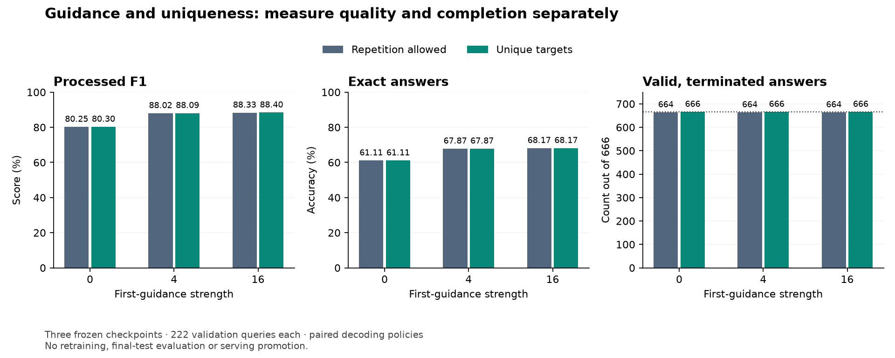

# Lesson 16: combining guidance with uniqueness

**2026-09-24.** First-target guidance improved relation quality; uniqueness
previously repaired completion without improving exact accuracy. This experiment
checks their interaction on the same frozen models. The
[declared plan](../experiments/2026-09-24-guidance-uniqueness-plan.md) fixes the
comparisons before the new evaluations.

## Two factors, four comparisons

A **factorial experiment** varies factors separately and together. For each
chosen guidance strength, we compare these cells:

| Cell | First-target guidance | Repeated targets |
| --- | --- | --- |
| Original | Off | Allowed |
| Guidance only | On | Allowed |
| Uniqueness only | Off | Blocked |
| Both | On | Blocked |

We test strengths 4 and 16. These are development choices informed by Lesson 15:
4 gained 45 exact answers without losing a baseline exact answer, while 16
had slightly higher aggregate quality but lost one. We report both strengths.
We do not assume either is best outside the tested grid.

For a quality metric M, define the interaction as:

```text
interaction = M(both) - M(guidance only)
              - M(uniqueness only) + M(original)
```

For example, if the four F1 values were 0.60, 0.70, 0.62, 0.75 respectively,
the interaction would be 0.75 - 0.70 - 0.62 + 0.60 = 0.03. The combined gain
would be three percentage points larger than adding the two individual gains.
A negative interaction means their improvements do not simply add together.
This arithmetic describes measured outcomes; it does not identify the internal
mechanism by itself. We calculate it per seed and keep the paired results.

## Why two separate masks can still interact

Guidance modifies product scores only at the initial ANSWER position. Uniqueness
masks IDs already emitted within the current answer. At the first choice there
are no previously emitted targets, so uniqueness must not change that choice.

After the first choice, the history can differ. If ordinary decoding wants to
repeat a target, uniqueness removes it and a different token wins. That token
then becomes context for every subsequent decision. A local mask can change
the entire remaining sequence; it is not equivalent to deduplicating the final
list after decoding.

For batch size eight, the state includes:

```text
first-position guidance scores      [8, 1025]
per-row seen-ID mask                 [8, 2049]  boolean
per-row active flags                 [8]        boolean
next-token scores                   [8, 2049]
```

Each query owns its mask. Subject IDs in the prompt do not initialize the seen
set, and EOS is never permanently blocked. We still do not force EOS at the
completion bound. The model must choose termination itself.

## Reuse evidence without silently changing the comparison

The guidance-only reports already contain complete outputs for all three seeds.
We reuse them only after checking file hashes, checkpoint/data/split identities,
runtime/source identity and the unchanged guidance and metric helper scripts.
This avoids spending GPU time to recreate evidence whose implementation has
not changed.

There are 1,998 new query executions: 222 queries x three seeds x three
strengths (0, 4, 16), all with uniqueness enabled. The alpha-zero unique cell
must replay its saved full outputs and metrics before a seed's combined runs.
Another 1,998 query-seed-setting observations are reused for the no-uniqueness
cells. They are paired comparisons, not independent new queries.

For every changed response, the audit requires:

- The same query identity and first emitted ID as guidance alone.
- A first divergent token after the initial decision.
- The no-uniqueness choice at that divergence was already emitted earlier.

This connects the observed difference to the intended intervention. We preserve
all outputs, including failures, rather than discarding difficult cases.

## What passing the gate would mean

The combined policy is compared with the **original decoder it could replace**.
It must produce valid, terminated, repeat-free answers on all 666 query-seed
observations, avoid per-seed processed-F1 and exact-set regression versus that
original, and improve mean exact-set accuracy. Candidate selection then uses
mean exact accuracy, mean F1 and smaller strength as successive tie-breakers.

This does not retroactively change Lesson 15's failed first-guidance-alone gate.
It also does not require uniqueness to improve every score relative to guidance
alone. Those marginal changes are a separate, explicitly reported comparison.
A combination could trade a small F1 reduction versus guidance alone for reliable
completion while still substantially improving on the original decoder.

Even a passing result would identify an integration candidate. It would not
establish oracle parity, final-test generalization or production serving behavior.

## What the independent residual analysis adds

While the interaction code was prepared, a parallel CPU analysis examined the
previous campaign. The
[residual-analysis receipt](../experiments/2026-09-24-guidance-residuals.json)
preserves the verified input hashes, classifications and individual observations.
At strength 4, the 214 exact-set failures are distributed as:

| First raw choice in a failed answer | TYPE | COLOR | Total |
| --- | ---: | ---: | ---: |
| Not a target member | 12 | 3 | 15 |
| A member, but not the teacher's first target | 148 | 8 | 156 |
| Exactly the teacher's first target | 43 | 0 | 43 |

Of the 43 failures that start exactly right, 42 still miss targets. Twenty-five
diverge by the second or third processed token. Only 15 of all 214 failures
contain raw duplicates, so uniqueness is unlikely to explain most of the gap.
That is a hypothesis about its reach, to be checked by the current experiment.

The dimension split matters: guidance strength 4 changes TYPE exact results
from 150 to 154 out of 357 query-seed observations, but COLOR from 257 to 298
out of 309. Most aggregate improvement came from COLOR. Fifty-one distinct
queries fail in all three seeds at strength 4, all TYPE.

A concrete continuation case is DOUBLADE TYPE at seed 1729. It starts with the
correct target but then emits AGGRON, skipping earlier teacher targets. Its
processed set has 64 correct products, no incorrect products and 61 missing
products. That is a coverage failure despite a correct start. A later experiment
can test whether continuation retains the original subject's whole relation;
this analysis alone does not prove what the model internally represents.

## Results: completion repair preserves the guidance gains

All 1,998 new executions completed. All 666 alpha-zero unique responses and
metrics replayed exactly. Every first emitted ID matches guidance alone, and
every first divergence replaces an already emitted target. The unchanged source,
checkpoint, reference and output hashes were verified.

| Guidance strength | Unique targets | Mean processed F1 | Exact answers | Valid / terminated |
| --- | --- | ---: | ---: | ---: |
| 0 | No | 80.245% | 407/666 (61.11%) | 664/666 |
| 0 | Yes | 80.296% | 407/666 (61.11%) | 666/666 |
| 4 | No | 88.024% | 452/666 (67.87%) | 664/666 |
| 4 | Yes | 88.094% | 452/666 (67.87%) | 666/666 |
| 16 | No | 88.329% | 454/666 (68.17%) | 664/666 |
| 16 | Yes | 88.399% | 454/666 (68.17%) | 666/666 |

Both combined settings pass the declared candidate gate. **Strength 16 with
uniqueness is selected for subsequent integration verification**, because its
mean exact accuracy is higher. This is a selection among the tested settings,
not evidence that 16 is universally optimal. The earlier standalone gate
failures remain part of the record. No production configuration or serving
checkpoint has been changed.



The [complete portable receipt](../experiments/2026-09-24-guidance-uniqueness.json)
includes both candidate decisions, all paired differences, divergence audits,
raw metrics, processing metrics and individual changes. The combined strength-16
raw F1 is 87.99%; processed F1 is 88.40%. Processing follows the same
subject-exclusion/deduplication rules as the controls.

## What uniqueness contributed

Relative to guidance alone, uniqueness changes 16 responses at strength 4 and
17 at strength 16. **It gains zero exact answers and loses zero exact answers.**
It removes all raw repeats and repairs the two missing-EOS failures.

At strength 16, its processed-F1 contribution is approximately +0.031, +0.094
and +0.086 percentage points at seeds 1729, 1730 and 1731 respectively. Thus no
seed's aggregate F1 regresses relative to guidance alone in this campaign,
although individual queries can regress.

The corresponding F1 interactions are +0.095, +0.026 and -0.061 percentage
points. The last is negative even though uniqueness improves that seed's F1:
its benefit is smaller after guidance than it was without guidance. Interaction
measures how a benefit changes across contexts, not whether the benefit itself
is positive. Exact-accuracy interaction is zero in all pairs.

For a concrete regression, DUNSPARCE COLOR at seed 1729 produces 174 raw targets
with the combined rule versus 10 with guidance alone. Processed F1 falls from
0.0421 to 0.0153. Preventing repetition can cause a longer wrong continuation;
aggregate gains must not hide that behavior.

## A completed answer can still be badly wrong

KECLEON TYPE at seed 1730 now emits 157 targets before EOS, and CARBINK TYPE at
seed 1731 emits 92. Their processed F1 values are only about 0.132. Uniqueness
ends the loops, but does not reconstruct the relation they were supposed to
enumerate. These repairs are identical with and without first-target guidance,
because the first choices on those two queries never changed.

The selected combined policy reaches 301/309 exact COLOR observations, but
only 153/357 exact TYPE observations. The remaining large research problem is
TYPE continuation and coverage. A clean termination indicator is an engineering
property, not a substitute for answer quality.

## Verification and the next boundary

The full suite passed 241 tests before the campaign. Parallel work contributed
the residual-error audit, 22 focused interaction tests, and a read-only map of
integration points. The experiment script and reused scoring helpers remained
unchanged during execution; no GPU jobs ran concurrently.

The next engineering step is an explicit default-zero guidance option shared
by serial and batched inference. Its outputs must match these archived tokens
before a real HTTP comparison. The independent review also identified a gap in
the existing HTTP verifier: it must compare full token IDs and decoding-policy
identity, including guidance strength, rather than only parsed targets and
completion flags. That strengthening has been identified but is not implemented
by this experiment. Oracle quality parity and protected final testing remain open.
