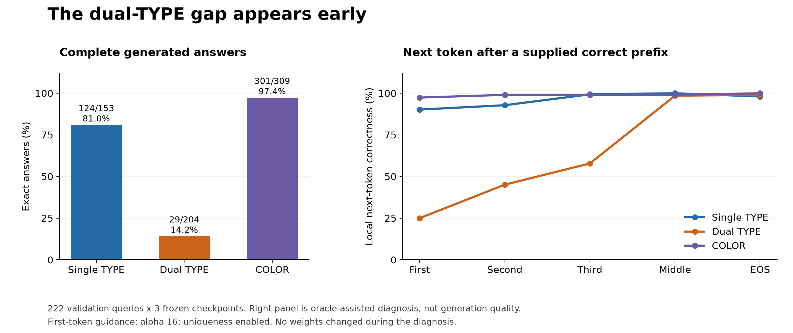

# Lesson 18: recognizing a group is not the same as enumerating a union

**2026-09-24.** The guided application works as tested, but its remaining errors
are concentrated in dual-TYPE queries. This lesson separates three questions:
does the model recognize the members, preserve the original query, and produce
the complete ordered answer?

## The structural difference behind the average

The same 222 validation queries are observed at three frozen checkpoints.
Counts below are query-seed observations, not distinct queries.

| Subject group | Exact processed answers | Mean F1 | Missing target observations |
| --- | ---: | ---: | ---: |
| One TYPE attribute | 124/153 (81.05%) | 0.92722 | 438 |
| Two TYPE attributes | 29/204 (14.22%) | 0.70870 | 11,855 |
| COLOR | 301/309 (97.41%) | 0.97831 | 804 |

For a subject with two attributes, A and B, the required target set is

$$
Y(s) = \big(G_A \cup G_B\big) \setminus \{s\}.
$$

Here $G_A$ means all products carrying attribute A. The union includes products
from either group; the intersection contains products carrying both. These
attribute names are analysis labels. They are never model input or output tokens.

Consider a subject S and three other products: U shares both attributes,
V shares only A, and W shares only B. The teacher wants U, V, W. Returning U, V
is a perfectly coherent A-group answer, but it omits W: precision is 1,
recall is 2/3 and F1 is 0.8. Exact-set accuracy is zero for that answer.

Of the 175 failing dual-TYPE observations, **75 return exactly one complete
attribute group**. A broader 107 cover exactly one group completely, sometimes
with additional products. Those categories overlap; they must not be added.

For example, at seed 1729, ARCTIBAX retains all 47 ICE targets but misses all
66 DRAGON-only targets. BAXCALIBUR has the same attribute signature, yet retains
the 69 DRAGON targets and misses the 44 ICE-only targets. These counts exclude
the subject as required by SAME. The learned continuation can favor different
branches even when the required union is structurally the same.

## Ordering adds another job

The compiler first orders products sharing both subject attributes, then those
sharing one. Within a shared-count tier it orders by confidence and product key.
The model must learn membership, coverage and this order from opaque IDs.

In dual-TYPE observations, it retains 890/945 shared-two targets (94.18%),
but only 22,259/34,059 shared-one targets (65.36%). The main missing mass is
therefore in the broader union, rather than the shared-two tier alone.

The number of training subjects with the same exact attribute signature also
correlates with quality. Within dual TYPE, zero supporting subjects gives 0/9
exact observations, one to four gives 9/153, and five or more gives 20/42.
This is an association. Rare signatures can differ in other ways, and these
numbers alone do not prove that oversampling would fix the problem.

Support is counted by attribute signature, not identical teacher lists. Two
same-signature subjects have slightly different target lists because each
excludes itself. Comparing those lists literally would hide their shared family.

## A probe is a controlled question to the model

The [declared diagnosis](../experiments/2026-09-24-continuation-diagnosis-plan.md)
supplies correct ordered prefixes and asks the frozen model for the next-token
scores at the first, second, third, middle and EOS positions, plus the first
observed divergence of its processed answer. Coincident positions are merged.

With p supplied target IDs, the input tensor has shape `[B, 5+p]`. The five
prompt IDs are BOS, subject, dimension, SAME and ANSWER. The decoder produces
`[B, 5+p, 2049]` logits; we inspect the last `[B, 2049]` slice. Protocol and
uniqueness masks remain active. Guidance strength 16 applies only at p=0,
matching the current first-target policy.

For each prefix, compare the original subject with a deterministic replacement
and with the last supplied target used as the subject. Only the subject token
changes. Fresh computation avoids reusing a cache belonging to another prompt.

We measure the teacher token's rank, probability, and margin:

$$
m = z_{\mathrm{teacher}} - \max_{j\ne\mathrm{teacher}} z_j.
$$

A positive margin means the teacher token beats every other allowed token.
We also measure total variation between the two next-token distributions:

$$
\mathrm{TV}(P,Q) = \tfrac12\sum_j |P_j-Q_j|.
$$

TV ranges from zero for identical distributions to one for disjoint probability
mass. Unlike top-choice agreement, it notices changed confidence even when
the most likely token stays the same.

The supplied prefix may contradict the replacement subject. Agreement with
the original teacher is therefore a sensitivity measurement, not correctness
against the replacement subject's true answer. These are teacher-forced probes,
not new generation-quality results. Prefix dependence does not by itself prove
that the model has internally forgotten its subject.

The separate symmetric head receives only the original five-token prompt and
produces `[1, 1025]` membership scores. At the previously fixed zero-logit
threshold, we count how many omitted targets it recognizes. That helps separate evidence of membership knowledge from sequence coverage,
while retaining the head's own classification errors.

## What the frozen-model probes found

All 666 query-seed observations completed: 3,352 distinct prefix probes and
9,390 condition scores. Every original first-token choice matched its archived
generation. Model source, checkpoints, data and runtime stayed unchanged.

For dual TYPE, the head recognizes **11,737 of the 11,855 omitted targets
(99.00%)**. Its mean set F1 is 97.43%, yet only 10/204 thresholded sets are exact.
The generator has 29/204 exact answers. A high membership F1 is therefore not
permission to substitute the head's thresholded list for the model's output.

| Supplied correct prefix ends before... | Single-TYPE next-token correctness | Dual-TYPE next-token correctness | COLOR next-token correctness |
| --- | ---: | ---: | ---: |
| First target | 138/153 | 51/204 | 301/309 |
| Second target | 142/153 | 92/204 | 306/309 |
| Third target | 152/153 | 118/204 | 306/309 |
| Middle target | 153/153 | 201/204 | 306/309 |
| EOS | 150/153 | 202/204 | 309/309 |

These are local next-token decisions under supplied correct context. They do
not mean 201/204 dual-TYPE answers generate correctly. The true count is still
29/204. The correct prefix helps the model enter the appropriate continuation;
free generation must construct that prefix itself.

For dual TYPE, rotating the subject produces mean TV of 0.957 at the first
position, 0.421 at the second, 0.399 at the third and 0.0052 at the midpoint.
The first position also has explicit learned guidance, so comparing it with
later positions mixes two scoring policies. Even the unguided second and third
positions are much more sensitive than the midpoint. This is consistent with
the supplied target prefix dominating later predictions. It is not proof of
a particular attention mechanism or causal memory loss.

The first observed divergence probes often remain wrong even after replacing
the preceding history with the teacher's history. That is unsurprising for
failures beginning at position zero, where no history can be repaired. We
retain those probes and their positions rather than presenting their pooled
accuracy as a pure continuation metric.

## The next experiment: supervise the remaining set early

The evidence suggests testing an auxiliary training objective at the first few
continuation states. After supplying p correct target tokens, ask the existing
contextual set head to predict the targets still to come:

$$
R_p = Y(s) \setminus \{y_1,\ldots,y_p\}.
$$

The main next-token objective teaches which ID comes immediately next. A
remaining-set objective also teaches that the other branch must remain present
in the model's representation. Past targets become negatives, connecting
coverage and non-repetition. This differs from the symmetric head, whose static
membership scores do not change as products are emitted.

This is a **selected next experiment, not an implemented improvement**. Reuse
the existing contextual set projection, keep the inference policy fixed and
compare fresh controls with candidates at the same training budgets and three
seeds. A new loss may compete with ordering or damage already correct COLOR
answers; full generation must decide whether it helps. The
[declared next comparison](../experiments/2026-09-24-continuation-set-plan.md)
records the intended objective, controls and acceptance criteria.

The structural analysis and model probes are recorded separately in the
[coverage receipt](../experiments/2026-09-24-type-coverage.json) and
[continuation receipt](../experiments/2026-09-24-continuation-diagnosis.json).
Complete per-query evidence and executed scripts remain in their referenced
`runs/learning/` directories. Neither diagnosis evaluates the protected test.

The complete automated suite passed **349 tests**. Independent review verified
all report/script/source hashes, query identities and joined statistics. Lint,
formatting and strict typing are checked with the final documentation update.
