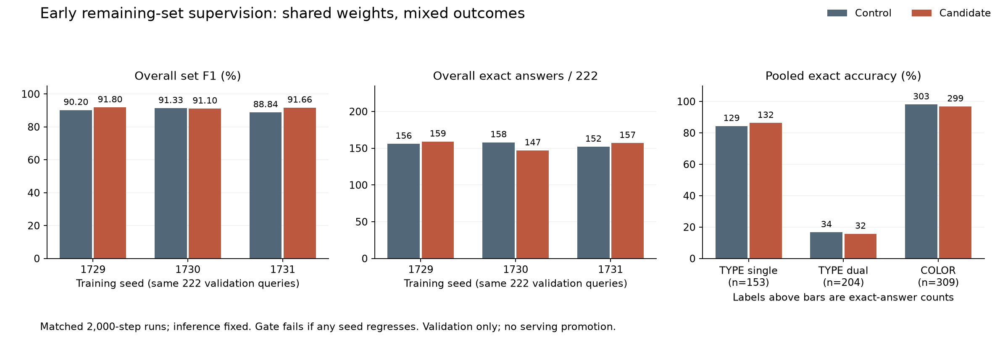

# Lesson 19: teaching early states what remains to be emitted

**2026-09-24. Implemented and tested; the six-run comparison fails its acceptance gate.**
The [union-coverage diagnosis](18-union-coverage.md) found that many dual-TYPE
answers contain a complete single branch of the correct relation. The model
often knows which products belong to the union, yet its generated sequence
leaves one branch out. This lesson explains the new training objective and the
[comparison declared before training](../experiments/2026-09-24-continuation-set-plan.md).
Mean F1 improves, but exact answers and dual-TYPE exact coverage decline. The
default-zero feature remains available for learning; these results do not
select the candidate for serving.

## Intuition: practice remembering the unfinished answer

Ordinary next-token training asks: “Given this prefix, which token comes next?”
Our contextual prompt-set objective already asks a broader question at ANSWER:
“Which products belong anywhere in the answer?” The new objective asks the
same head, shortly after generation has started: **“Which products are still
waiting to be emitted?”**

Suppose the complete answer is `[A, B, C, D]`. After the teacher has supplied A,
we supervise the hidden state with remaining set `{B, C, D}`. After B, the set
is `{C, D}`; after C, it is `{D}`. These are three checkpoints in the early
continuation, not three separately trained models.

This is an **auxiliary objective**: an additional training signal that shares
the main model's parameters. The hypothesis is that a state trained to retain
the unfinished union will also make better next-token choices. That transfer
must be measured. Correct auxiliary membership predictions do not by themselves
prove that free generation enumerates the whole answer.

## Which positions receive supervision?

Our sequence uses zero-based positions:

| Position | Input token | Hidden state has seen | New remaining-set supervision |
| --- | --- | --- | --- |
| 0 | BOS | Start marker | None |
| 1 | SUBJECT | Subject identifier | None |
| 2 | DIMENSION | TYPE or COLOR | None |
| 3 | SAME | Relation mode | None |
| 4 | ANSWER | Complete prompt | Existing prompt-set objective |
| 5 | First teacher product | One answer product | Products after position 5 |
| 6 | Second teacher product | Two answer products | Products after position 6 |
| 7 | Third teacher product | Three answer products | Products after position 7 |

If \(p\in\{1,2,3\}\) counts consumed teacher products, the hidden-state position
is \(t=4+p\). Its remaining labels start at \(t+1\), which is \(5+p\).
That distinction is the important off-by-one boundary: the product at the
current position has already been consumed and must not remain positive.

The ordinary causal loss still predicts the next token from each state. At
position 5, for example, it predicts the second product. Both objectives use
the same causal representation but ask different questions about it.

## The tensors and reused weights

Let \(H\in\mathbb R^{B\times T\times D}\) be the final normalized hidden states.
For the current recipe, \(B=32\) and \(D=256\); \(T\) is the padded sequence
length of that training batch. The new head selects:

\[
H_c = H[:,5:8,:]\in\mathbb R^{B\times S\times D},\qquad S\leq3.
\]

Normally \(S=3\). A shorter input may supply fewer positions. Eligibility is
checked separately for each row, so EOS or padding in one row does not create
another supervised stage just because other rows are longer.

The existing contextual projection is \(W\in\mathbb R^{D\times D}\), without a
bias. The shared product embedding rows form
\(E\in\mathbb R^{N\times D}\), with \(N=1025\) in the current catalog. Under
the row-vector convention used by PyTorch's linear operation:

\[
Z = (H_cW^\top)E^\top
\in\mathbb R^{B\times S\times N}.
\]

For a usual batch, the dimensions are:

```text
normalized[:, 5:8]       [32, 3, 256]
prompt_set_projection   [256, 256]       existing learned weight
product embeddings      [1025, 256]      existing shared embedding rows
continuation scores     [32, 3, 1025]
```

The full token vocabulary has 2,049 rows. Only rows `1024:` enter these scores;
EOS, control tokens and reserved vocabulary slots are absent. The projection
uses the current training precision; the binary-loss arithmetic casts scores
to FP32. No new parameters, vocabulary entries or protocol tokens are added.
Reusing weights still adds computation and training signal; it does not imply
unchanged training cost.

## Constructing the remaining-target mask

For query \(i\), write its teacher answer as
\((y_{i,1},\ldots,y_{i,m_i})\) and its subject as \(s_i\). At stage \(p\), the
positive set is:

\[
R_{i,p}=
\{y_{i,p+1},\ldots,y_{i,m_i}\}
\setminus
\bigl(\{s_i\}\cup\{y_{i,1},\ldots,y_{i,p}\}\bigr).
\]

All products outside \(R_{i,p}\) are negatives. In particular, the subject and
already supplied products receive negative labels. This differs from the
static symmetric objective, which excludes the subject column from its loss.

The implementation forms a binary `[B, N]` mask at each stage. It gathers
product IDs from the future **labels**, converts repeated positives into a
single set membership, and clears consumed-product and subject columns. A
product repeated later therefore cannot become positive again after it has
been consumed.

The labels are input-aligned; the existing forward path first applies the
attention mask to them. Entries masked to `-100`, EOS and padding do not count
as remaining products. A stage is eligible only if its consumed prefix consists
of supervised product positions and its remaining positive set is nonempty.

Why skip empty remaining sets? The normal next-token objective already teaches
EOS. This auxiliary objective focuses on coverage while products remain; it
does not add an independent EOS predictor or a stopping rule.

## Balancing classes, stages and queries

Most product columns are negative. An unbalanced binary average could be reduced
by predicting “no” for nearly everything. We instead give the positive and
negative classes equal total weight at each eligible stage.

For product score \(z_{i,p,v}\), the binary losses can be written with
\(\operatorname{softplus}(x)=\log(1+e^x)\):

\[
\ell_{i,p}=\frac12\left[
\frac{1}{|R_{i,p}|}\sum_{v\in R_{i,p}}\operatorname{softplus}(-z_{i,p,v})
+
\frac{1}{N-|R_{i,p}|}\sum_{v\notin R_{i,p}}\operatorname{softplus}(z_{i,p,v})
\right].
\]

This is class-balanced **binary cross-entropy**. Each product is an independent
yes/no prediction; unlike a next-token softmax, many products can be positive
simultaneously. Equal class weighting is a training choice, not evidence that
the resulting sigmoid scores are calibrated probabilities.

Let \(V_i\) be query \(i\)'s eligible stages and let
\(Q=\{i:|V_i|>0\}\). We average in two steps:

\[
L_i=\frac{1}{|V_i|}\sum_{p\in V_i}\ell_{i,p},\qquad
L_{\mathrm{continuation}}=\frac{1}{|Q|}\sum_{i\in Q}L_i.
\]

This gives participating queries equal weight. For example, a four-product
answer contributes three stages, while a two-product answer contributes only
one. In a batch containing those two queries, each query contributes half the
auxiliary loss. The longer query's stages each have weight \(1/6\); the short
query's single stage has weight \(1/2\). Averaging all four stages directly
would instead give the longer query three times as much weight.

A one-product answer has no eligible stage. If an entire batch has no eligible
query, the implementation returns **differentiable zero** and query count zero.
“Differentiable” means the zero remains connected to the computed scores, so
backpropagation produces zero gradients cleanly. It does not create dummy
positive targets or divide by zero. The ordinary token and prompt-set objectives
still train on that batch.

## Adding the objective and reading its logs

The new setting is `model.continuation_set_loss_weight`, default `0.0`.
Positive values require `model.prompt_set_loss_weight > 0`, because the
projection must already exist. The selected recipe keeps the original
prompt-set and symmetric coefficients at one and tests continuation coefficient
one against a fresh coefficient-zero control:

\[
L_{\mathrm{total}}=
L_{\mathrm{token}}+L_{\mathrm{prompt\ set}}+L_{\mathrm{symmetric}}
+\lambda_cL_{\mathrm{continuation}},\qquad \lambda_c\in\{0,1\}.
\]

This expression omits other optional penalties that are unchanged by the
experiment. Increasing the number of loss terms can increase total loss even
when token prediction improves, so compare the components separately.

`ModelOutput` exposes `continuation_set_loss` and
`continuation_set_query_count`. When disabled or called without labels, these
are `None` and zero; this differs from the differentiable zero returned by an
enabled objective with no eligible stages. Training history records:

- `last_batch_continuation_set_loss` and `last_batch_continuation_set_query_count`.
- `validation_continuation_set_loss` and `validation_continuation_set_query_count`.

Validation combines batch auxiliary means using their participating-query
counts. For batch means \(L_b\) and counts \(q_b\), it reports
\(\sum_bq_bL_b/\sum_bq_b\). An ineligible batch has weight zero. If the entire
validation partition has zero eligible queries, the reported auxiliary loss is
zero with count zero; that is absence of supervision, not perfect predictions.
Validation token cross-entropy remains separately weighted by supervised token
count.

## Future labels are supervision, not hidden-state inputs

During teacher forcing, the full answer is available to construct training
labels. Nevertheless, the hidden state after the first product may attend only
to the prompt and that product. It cannot read the later products whose
membership it is asked to predict. This is ordinary supervised learning: the
answer determines the loss, while the features remain causal.

A focused test changes a product after positions 5–7 and checks that all three
earlier projected states remain exactly unchanged. Other tests check numerical
suffix shifts, negative consumed products, equal query weighting, short inputs,
product-valued masked padding, zero gradients when no stage is eligible, and
gradient flow into the shared projection, embeddings and attention weights.

The zero setting creates no new parameters or random draws and retains the old
loss/logit computation. Tests compare parameter values, RNG state and logits
between otherwise identical zero/positive configurations. With labels absent,
no continuation auxiliary loss is computed. No remaining-target labels or graph
facts enter inference, and this training change introduces no decoding mask.

Teacher forcing still uses correct prefixes. It therefore leaves a possible
**exposure gap**: generation must continue from its own mistakes, not always
from teacher tokens. A lower continuation loss might fail to improve that
behavior, which is why the experiment measures complete free-generated answers.

## The comparison we will actually judge

The declared comparison uses six fresh runs: coefficient-zero control and
coefficient-one candidate at training seeds **1729, 1730 and 1731**. Both arms
use the same frozen source, pinned National Dex snapshot, split seed 1729,
batch size 32 and 2,000 optimizer updates, with the other symmetric-recipe
settings unchanged. Fresh controls keep the code comparison contemporaneous.
Run/checkpoint/config/runtime identities are recorded. These CUDA runs retain
the existing nondeterministic setting; equal seeds do not promise bitwise
repeatability. GPU jobs run sequentially.

This matches optimizer updates and batch size, not floating-point operations or
wall-clock time. The candidate computes another projection and binary loss at
each update. Its parameter count remains **6,689,792**, while its training cost
may rise. Record elapsed time as a practical observation, not an isolated GPU
kernel benchmark or an energy measurement.

Evaluation holds inference fixed: **alpha-16 first-target guidance, target
uniqueness, KV cache, offline batch size eight and a 507-token completion bound**.
Every checkpoint is evaluated on all 222 validation queries. The evidence must
include raw tokens, processed outputs, EOS/validity, F1 and exact answers, and
query-level gains/losses split into single TYPE, dual TYPE and COLOR.

The candidate passes the declared further-integration gate only if:

1. Every candidate response is valid, terminated and free of repeated IDs.
2. No seed regresses in overall processed F1 or exact-set accuracy.
3. Mean overall exact-set accuracy strictly improves.
4. Pooled dual-TYPE exact answers strictly improve.

COLOR regressions and other subgroup tradeoffs must remain visible even if this
gate passes. A failed run is evidence; changing the coefficient after seeing
results requires another declared trial. This comparison does not access the
protected final test, promote an HTTP deployment or establish oracle parity.
The full results below distinguish an implemented objective from an accepted
model improvement.

## Why an extra objective can help and hurt

The same attention layers, projection and embeddings receive gradients from
several tasks. If their parameters are collected into a vector \(\theta\), an
optimizer update is driven by the sum:

\[
g = \nabla_\theta L_{\mathrm{token}}
  + \nabla_\theta L_{\mathrm{prompt\ set}}
  + \nabla_\theta L_{\mathrm{symmetric}}
  + \lambda_c\nabla_\theta L_{\mathrm{continuation}}.
\]

For a simple gradient-descent illustration, \(\theta' = \theta-\eta g\).
Our actual optimizer also maintains adaptive moment estimates. The illustration
shows why adding supervision does not guarantee improvement: the new gradient
changes the direction of the shared update. It may favor features useful for
remembering a large set while making an exact next-token choice harder.

This is a possible mechanism, not a measured diagnosis of gradient conflict in
this trial. We did not compute gradient angles or isolate each objective's
effect. Training randomness, finite capacity and a fixed update budget also
limit what these six runs can establish.

Two useful metric distinctions follow:

- **Set F1** gives partial credit for overlapping members:
  \(F_1=2|\widehat Y\cap Y|/(|\widehat Y|+|Y|)\).
- **Exact-set accuracy** gives one point only when \(\widehat Y=Y\). A single
  missing or extra member makes that query inexact, even if F1 is near one.

An objective can improve coverage across difficult answers while turning some
previously perfect answers into almost-perfect ones. That can raise average
F1 and lower the number of exact answers at the same time. We retain both
metrics because the serving contract needs complete, correct identifier sets.
Reported F1 is the mean of per-query F1 values, so every query has equal weight.
The three seeds reuse the same 222 validation queries; 666 query-seed observations
are not 666 independently sampled queries. Three runs provide a small view of
training variation, not a population-level confidence guarantee.

## Measured result: better overlap, fewer complete answers

Every run completed 2,000 updates. Every candidate output is valid, terminated
and repeat-free. The following numbers apply the existing deterministic serving
post-processing, which removes the SAME subject from the answer. It does not
filter candidates by oracle membership.

| Training seed | Control F1 | Candidate F1 | Control exact / 222 | Candidate exact / 222 | Exact change |
| --- | ---: | ---: | ---: | ---: | ---: |
| 1729 | 90.20% | 91.80% | 156 | 159 | +3 |
| 1730 | 91.33% | 91.10% | 158 | 147 | -11 |
| 1731 | 88.84% | 91.66% | 152 | 157 | +5 |
| Mean / pooled counts | 90.12% | 91.52% | 466 / 666 | 463 / 666 | -3 |

Across seeds, sample standard deviation of F1 is 1.25 percentage points for
control and 0.37 for candidate. Exact accuracy is 69.97% versus 69.52%, with
sample standard deviations 1.38 and 2.90 percentage points. These are descriptive
three-run statistics. They do not establish a general reduction in variance.

The candidate gains 33 previously inexact query-seed answers and loses 36
previously exact ones. This is more informative than just the net change of -3.



| Group | Control exact | Candidate exact | Change |
| --- | ---: | ---: | ---: |
| Single TYPE | 129 / 153 | 132 / 153 | +3 |
| Dual TYPE | 34 / 204 | 32 / 204 | -2 |
| COLOR | 303 / 309 | 299 / 309 | -4 |

Dual-TYPE F1 improves in all three seeds, yet its exact count declines overall.
That is the central research result: this particular objective improves partial
coverage without reliably completing the union. It fails three acceptance
conditions: seed 1730 regresses; mean exact accuracy does not improve; and pooled
dual-TYPE exact accuracy does not improve. Only the validity/completion/uniqueness
condition passes. We keep the original rule rather than selecting a favorable
metric after observing results.

Raw output evidence is preserved too: mean raw F1 rises from 89.70% to 91.10%,
and raw exact counts are 0/666 versus 5/666. The large raw/processed exact gap
reflects how sensitive exact-set scoring is to an extra subject identifier.
Subject removal is the same established policy in both arms, not a new rescue
rule introduced for this candidate.

Three paired failures from seed 1730 make the tradeoff concrete. Each control
answer was exact:

| Query | Candidate true positives | False positives | False negatives | What changed |
| --- | ---: | ---: | ---: | --- |
| BUDEW / TYPE | 82 | 0 | 113 | Correct first choice retained; much of the union omitted |
| EKANS / TYPE | 82 | 113 | 0 | Correct first choice retained; many unrelated products added |
| DEWGONG / COLOR | 1 | 93 | 86 | First choice changed; almost the entire answer is wrong |

**True positives** are correctly returned products, **false positives** are
returned products that do not belong, and **false negatives** are missing
products that should have been returned. BUDEW and EKANS show that fixing only
the first choice cannot explain or repair every failure. These observed cases
do not identify the internal causal mechanism by themselves.

### Loss improves even when generation regresses

| Seed | Control validation token CE | Candidate validation token CE | Candidate continuation loss | Control training seconds | Candidate training seconds |
| --- | ---: | ---: | ---: | ---: | ---: |
| 1729 | 0.13076 | 0.12250 | 0.04036 | 69.31 | 73.70 |
| 1730 | 0.13143 | 0.12134 | 0.04651 | 67.67 | 78.43 |
| 1731 | 0.13220 | 0.12465 | 0.04625 | 68.68 | 75.81 |

Each candidate validation auxiliary mean includes all 222 queries. Token CE
improves in every pair, including seed 1730, whose complete-answer quality
regresses. Teacher-forced loss averages predictions along correct prefixes;
generation follows the model's own choices. A small number of damaging choices
can redirect an entire answer without dominating average token loss.

Mean observed training time increases from 68.55 to 75.98 seconds, about 10.84%.
These are sequential runs on this Windows/RTX 5070 Ti environment, with one
timing per seed/arm. They do not isolate compute overhead from run variation,
measure energy, or predict serving latency. Inference computes no new objective.

## Evidence and the next question

The [portable experiment receipt](../experiments/2026-09-24-continuation-set.json)
records all six checkpoint/config/source identities, metrics and gate outcomes.
Full tokens, paired query details, frozen analysis scripts and source archive
are under `runs/learning/continuation-set-v1/`. The core source stayed frozen
through all training and evaluation runs. The summary SHA-256 is
`558d18391131333461efee09c3045848a8ffbca7a6a5e4b3d436ac7d49fbf819`.

An independent CPU audit reconstructs token identities and set arithmetic
without the shared generation metric/post-processing evaluator. It reproduces
the metrics, subgroup tradeoffs, gains/losses and acceptance gate. Implementation
and audit work ran in parallel with explicit file ownership; GPU jobs remained
sequential. The full test suite passes **406 tests** (one existing dependency
warning), including 38 campaign-audit tests. Ruff, formatting and strict typing
also pass.

These are fresh matched controls. The earlier guided checkpoints achieved
454/666 exact answers, but comparing only this candidate with that historical
number would hide the stronger fresh control's 466/666. CUDA training remains
nondeterministic; historical versus fresh differences do not establish an
effect of the new objective.

The next useful question is where free generation diverges despite lower
teacher-forced loss. Inspect paired first mistakes and the remaining-target
scores around them before selecting another coefficient or objective. This
experiment neither proves that all continuation supervision fails nor justifies
turning this coefficient on by default. Oracle parity, the protected final test,
and matched-quality serving/concurrency/energy measurements remain open.
