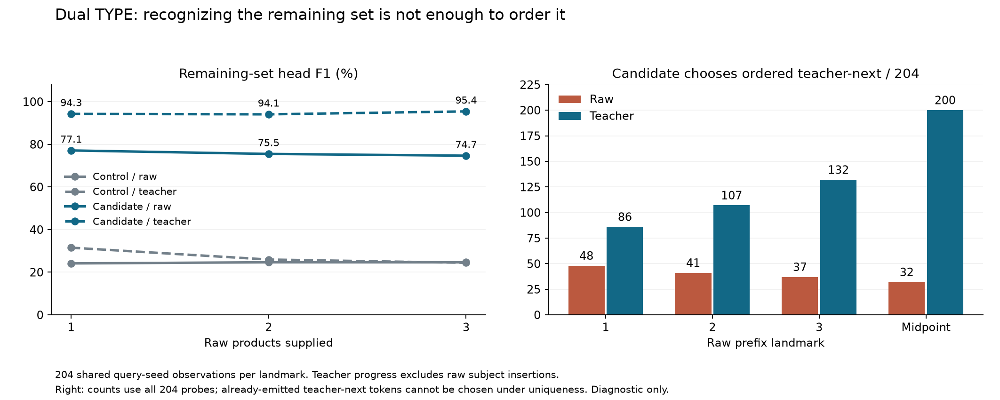

# Lesson 20: what changes when the model follows its own answer?

**2026-09-24. Diagnostics and independent audit complete; weights and generation quality unchanged.**

[Lesson 19](19-continuation-set-training.md) produced a puzzle: all three new
models improved validation token loss, but their complete-answer acceptance gate
failed. We now inspect the context at the point where generation goes wrong.
The [diagnostic plan](../experiments/2026-09-24-matched-prefix-plan.md) was written
before running the probes. All six checkpoints and their decoding policy stay fixed.

## A small local improvement can coexist with a bad complete answer

Let the prompt be \(x\) and the teacher answer be
\(y_1,\ldots,y_m,\mathrm{EOS}\). Teacher-forced cross-entropy measures:

\[
L_{\mathrm{token}}=-\frac{1}{m+1}\sum_{t=1}^{m+1}
\log p_\theta(y_t\mid x,y_{<t}),
\qquad y_{m+1}=\mathrm{EOS}.
\]

During actual generation, the model conditions on its own earlier choices:

\[
\widehat y_t=\operatorname*{argmax}_{v\ \mathrm{legal}}
p_\theta(v\mid x,\widehat y_{<t}).
\]

This displays the base autoregressive rule; our fixed first-target guidance
also modifies the first position's scores, as described in Lesson 17.
The two prefixes agree until the first different choice. Afterwards, an improved
average probability along the teacher path says little about some of the states
visited by the generated path. This is an **exposure gap**: training
and evaluation expose the model to different kinds of context. This phrase
describes a possible issue; we still need measurements to establish where it
matters in this project.

Even before any prefix error, average loss and argmax decisions differ. Moving
probability from 0.001 to 0.01 on many correct tokens reduces loss, while a few
close competitions can flip the selected next token. A single bad choice can
redirect a long answer. This is why we inspect both distributions and choices.

## There are two sequences to keep track of

Suppose the expected answer is `[A, B, C]` and the model emits
`[A, SUBJECT, B, C]`. Our deterministic post-processing removes SUBJECT, so
the final set is correct. But when predicting B, the model actually saw
`[A, SUBJECT]`, not just `[A]`.

Post-processing transforms the output; it does not rewind the model's hidden
states or its key/value cache. We therefore retain a map between **raw position**
and **processed position**. A subject insertion can precede a later failure, but
that ordering alone does not show it caused the failure.

Likewise, `[B, A, C]` differs from the teacher at its first position but still
returns the correct set. `[A, C]` omits B without including any unrelated
product. `[A, B, X, C]` adds an unrelated product without omitting anything.
These require different explanations. “First wrong token” is too vague unless
we specify whether we mean ordering, membership, or stopping.

## Comparing a generated prefix with a teacher prefix

For a raw prefix containing \(p\) product tokens, define
\(c(p)\) as the number of consumed tokens other than SUBJECT. We compare:

- The actual raw prefix, including wrong products and any emitted subject.
- The first \(\min(c(p),m)\) products from the correct teacher answer.

Wrong products count toward \(c(p)\). Counting only correct ones would use oracle
knowledge to decide how much progress the model had made. This comparison matches
positions approximately; it does not make the two prefixes semantically equal
or equally difficult. The teacher condition is explicitly assisted by the oracle.
If the raw prefix contains only SUBJECT, its teacher counterpart is the bare
prompt. First-token guidance then applies to the teacher condition but not to
the raw condition, which is already one step into generation. The evidence
records this policy application difference explicitly.

Every probe starts with a fresh full-prefix prefill, so it cannot inherit a cache
from another condition. With a five-token prompt and \(p\) supplied products,
the input tensor has shape `[1, 5+p]`. The decoder produces logits of shape
`[1, 5+p, 2049]`; we inspect the last position's `[2049]` scores. Guidance applies
only when \(p=0\); uniqueness masks products already emitted in that condition.

We inspect early prefixes, a midpoint, the generated endpoint, and the mapped
first ordered divergence. Coincident positions share one computation but retain
all their names. An endpoint after the last product predicts EOS when generation
terminated; an exhausted token budget has no archived next choice to compare.
Identical prefixes may reuse computed score tensors, never a different condition's
KV cache. The divergence landmark exists only for ordered-inexact answers, so its
denominator differs from the early landmarks; comparisons must retain those counts.

## Score the remaining set as well as one ordered token

Let \(Y\) be the correct product set and \(C\) the consumed raw product set.
The remaining correct set is
\(R=Y\setminus(C\cup\{\mathrm{SUBJECT}\})\). From the legally masked
next-token distribution \(q\), we can measure:

\[
M_R=\sum_{v\in R}q(v).
\]

This is the probability mass assigned to still-needed products. It asks a
broader question than whether the highest-scoring token equals the next product
in the teacher's deterministic order. If the teacher-next token was already
emitted out of order, uniqueness makes it illegal; we report that exact-token
score as unavailable rather than secretly unmasking it.

When nothing correct remains, EOS is the appropriate completion choice. Before
that point, choosing EOS leaves omissions. A high remaining-product mass still
does not guarantee future success: it says where this one next-token distribution
puts its weight, not whether the eventual sequence will cover every member.

We also reuse the auxiliary head introduced earlier. A temporary observation
hook captures the final normalized state \(h\in\mathbb R^{1\times256}\), and
the existing projection and embeddings produce:

\[
z=(hW^\top)E^\top\in\mathbb R^{1\times1025}.
\]

At a fixed zero-logit threshold, compare its positive set with \(R\) using
true positives, false positives and false negatives. This runs no learning
step and adds no weights. The candidate was explicitly trained for this task
after one, two and three teacher products. Later states and mistaken generated
prefixes are different conditions; the head's performance there is an empirical
question. Its sigmoid scores should not be assumed to be calibrated probabilities.

## What this diagnosis can establish

If the teacher-prefix probe is good where the raw-prefix probe is poor, that
supports a prefix-conditioned gap. It does not isolate which changed token caused
it. If the membership head retains the missing products but generation omits
them, recognizing members and serializing the complete answer remain separate
problems. If both fail, the representation itself may lack useful information.
Those interpretations suggest different interventions, rather than proving one.

Full-prefill probes may differ numerically from the archived batched incremental
decode. We record next-choice agreement as an explicit check. A mismatch must
remain visible; probe output is not substituted for the archived generated answer.
The original six-run quality numbers and failed gate remain authoritative.

## What the saved sequences show

The CPU analysis verifies the six full-token reports and classifies all 1,332
query-seed answers. Both arms emit the subject in **647/666** answers. Subject
presence alone therefore does not explain why the candidate loses exact answers.

| Processed outcome | Control | Candidate |
| --- | ---: | ---: |
| Exact sequence | 466 | 462 |
| Correct set, different order | 0 | 1 |
| Missing products only | 126 | 132 |
| Extra products only | 4 | 5 |
| Both missing and extra products | 70 | 66 |

The candidate's one correct reordered answer is BRUTE_BONNET / TYPE at seed
1730. It counts toward 463 exact sets, even though it differs from the ordered
teacher sequence. We must not turn an ordering diagnostic into a stricter
replacement for the declared set-quality criterion.

Only three control failures and zero candidate failures are a strict correct
prefix followed immediately by EOS. This rules out simple early stopping along
an otherwise perfect prefix as the dominant observed failure. It does not mean
the candidate never stops with missing products: it usually diverged earlier.

For dual TYPE, the first processed product matches the teacher in **59/204**
control observations and **72/204** candidate observations. Nevertheless, exact
sets decline **34/204 -> 32/204**. Improving how an answer starts is useful, but
these starts do not consistently turn into complete unions.

Among the 36 answers that lose exactness, only three candidate sequences insert
the subject within the first three raw positions. Any subject insertion precedes
the first ordered divergence in ten of those 36 losses. Subject history is worth
tracking, but it cannot be the sole explanation of these regressions. These are
temporal associations; no subject-removal intervention was run.

## What the frozen model probes show

All **1,332 query-seed-arm observations** completed: 7,980 paired prefix probes,
15,960 condition scores and 11,272 distinct prefills. Every sampled raw-prefix
choice matches its archived next token: **7,980/7,980**. This verifies the sampled
decisions, not every possible prefix or a new complete-generation campaign.

For dual TYPE, the candidate's remaining-set head behaves very differently
under generated and teacher prefixes:

| Raw products supplied | Candidate head F1, raw prefix | Candidate head F1, matched teacher prefix |
| --- | ---: | ---: |
| 1 | 77.12% | 94.27% |
| 2 | 75.49% | 94.06% |
| 3 | 74.67% | 95.44% |

Each row has 204 query-seed observations per condition. The corresponding
control head scores only about 24–32% at these positions, where it was not
explicitly trained. The new objective therefore learned its auxiliary task.
Its strength on correct prefixes does not fully transfer to generated prefixes.

The gap is larger among the candidate's 203 final-set failures: raw-prefix head
F1 is 73.50%, 71.38% and 69.99%, compared with teacher-prefix 94.25%, 93.99% and
95.10%. Yet early next-token mass on remaining valid products is **higher** on
raw prefixes (85–89%) than on teacher prefixes (74–81%). This is not a
contradiction: most probability can stay within one correct branch while the
sequence fails to enumerate the whole union in a useful order.

At the matched midpoint, the candidate selects the ordered teacher-next token
in 32/204 raw-prefix probes versus 200/204 teacher-prefix probes. For raw
prefixes, that teacher token is still legal in only 98/204 cases; the others
already consumed it out of order. The all-probe counts in the figure deliberately
keep those cases visible rather than silently changing denominators.

### Some failures begin even on the correct prefix

BUDEW / TYPE at seed 1730 starts correctly with AMOONGUSS. At the next position,
raw and teacher prefixes are identical. The candidate's head has **191 true
positives, 2 false positives and 3 false negatives** (F1 98.71%), but its token
head chooses ARBOK instead of the teacher's BELLSPROUT. The eventual answer
omits 113 correct products.

This is evidence of a second gap: even a strong remaining-set representation
does not guarantee the appropriate ordered next-token decision. Exposure to
generated mistakes cannot be the whole explanation, because this choice is
already wrong on the correct prefix. The two heads share representations but
answer different questions and are trained by different losses.

Among the 36 newly lost exact cases, raw first-choice ordered accuracy falls
**34/36 -> 11/36**, while choosing any correct first member changes **34/36 ->
35/36**. Many changed starts still belong to the right relation. This motivates
testing ordered-start supervision, while BUDEW shows why that alone may not
resolve continuation.

### Do not turn the late head into an EOS gate

All 172 failing candidate dual-TYPE answers stop with missing products. At their
raw endpoints, the mean probability mass on remaining products is about 0.0021%.
Those endpoints follow earlier divergence; they are not correct prefixes merely
stopping too soon. The remaining-set head is also poor at these late, unsupervised
positions. For all 204 dual-TYPE endpoints it produces 77,298 false positives
in total. Using that head to block EOS would be an unvalidated new policy, not
a repair justified by the head's early teacher-prefix results.

## Evidence and the next controlled trial

The [sequence-analysis receipt](../experiments/2026-09-24-matched-errors.json)
and [prefix-probe receipt](../experiments/2026-09-24-matched-prefixes.json) retain
identities, metrics, interpretation limits and links to full local evidence.
Independent CPU analysis verifies saved prefix alignment, masks, guidance flags,
head arithmetic, aggregates and all archived-next comparisons. It does not
independently recompute the neural network. Full suite: **434 tests pass**, with
one existing dependency warning; formatting, lint and strict typing also pass.

The next [declared trial](../experiments/2026-09-24-continuation-order-plan.md)
tests first-target weight eight with the continuation objective retained.
This uses an existing loss-weight setting, preserves canonical teacher ordering,
and changes no inference policy. Eight is an exploratory choice, not an estimated
optimum. Compare against both the failed continuation candidate and the stronger
original matched controls; the original controls remain the acceptance reference.
The earlier weight-32 failure used a recipe without these membership objectives,
so it does not settle this interaction. The BUDEW example remains an explicit
limitation of focusing on the first choice.

No new weights were trained in this diagnosis. The previous candidate gate still
fails, and protected-test evaluation and serving promotion remain untouched.
