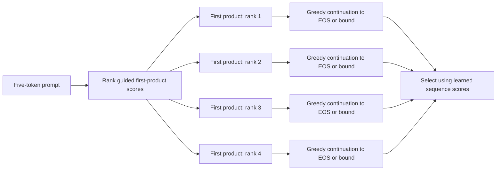
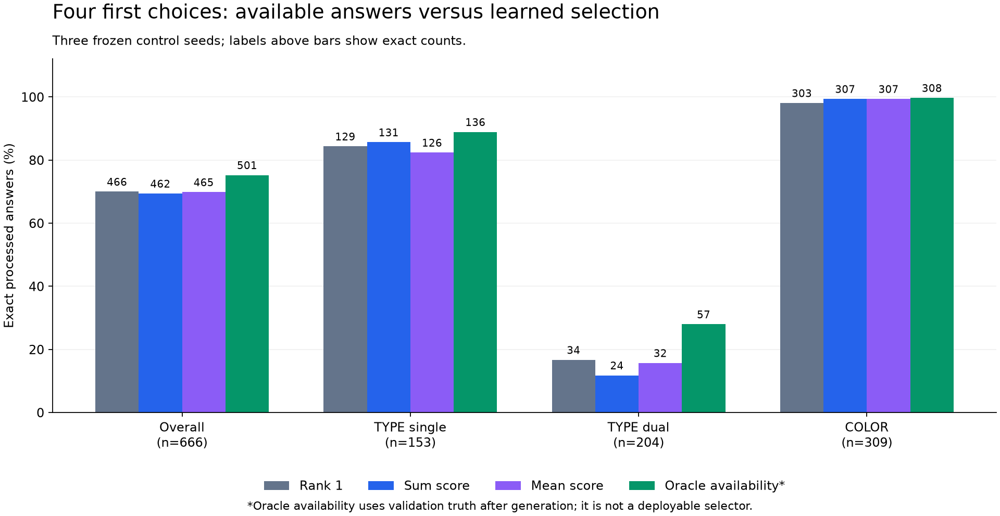

# Lesson 22: finding a good answer versus recognizing it

**2026-09-24. Completed; both learned selectors fail the acceptance gate.**

[Lesson 21](21-weighting-the-first-choice.md) found that weighting first-target
training more strongly did not improve held-out enumeration. We now keep the
weights fixed and change how we explore their predictions. The question is
whether the model already has useful continuations behind its next few most
likely first products, and whether it can select them without an answer key.

## A small fork at the first decision

The existing decoder takes the highest-scoring first product and then repeatedly
takes the highest-scoring legal next token. This is **greedy decoding**: each
decision is locally best under the current scores, without comparing its eventual
complete answer with alternatives.

Our diagnostic retains the four highest-scoring legal first products. It then
continues each path greedily. Only the first decision branches. We do not expand
four alternatives again at every later position; that would be a different
search algorithm with different costs and choices.

Rank 1 must reproduce every token of the archived greedy answer. This is our
control inside the new experiment. A branch includes its chosen first product
in its 507-token budget and uniqueness state. EOS is never forced; a path that
exhausts its budget is a recorded failure.

The generation function sees the subject, dimension, vocabulary and learned
weights. It receives no expected targets or graph relationships. A different
first member comes from model scores, not an oracle hint.

## Probabilities of complete paths

Let \(x\) be the protocol prompt and \(y=(y_1,\ldots,y_L)\) an emitted path,
with its final EOS included. The probability chain rule gives:

\[
p(y\mid x)=\prod_{t=1}^{L}p(y_t\mid x,y_{<t}).
\]

We store logarithms because multiplying many small probabilities is numerically
awkward. Products become sums:

\[
S_{\mathrm{sum}}(y)=\sum_{t=1}^{L}\log p(y_t\mid x,y_{<t}).
\]

Our probabilities are computed **after** protocol masking, target uniqueness,
and first-decision guidance. They describe the constrained decoding policy.
They are not probabilities from the untouched model logits. In particular,
the first-token distribution is normalized over all legal products, not just
the four retained branches.

The primary selector chooses the valid completed path with the highest sum.
A fixed secondary selector chooses the highest mean:

\[
S_{\mathrm{mean}}(y)=S_{\mathrm{sum}}(y)/L.
\]

Both include the first product and EOS. Otherwise we could reward a path for
an improbable first choice by excluding the price it paid to make that choice,
or reward an answer that never learned to stop.

## Why length changes the comparison

Consider an invented example, not a measurement from our model. Path A has
three tokens with probabilities \(0.6,0.9,0.9\). Path B has ten tokens with
first probability \(0.3\) and nine subsequent probabilities of \(0.99\).

| Illustrative path | Sum log probability | Mean log probability |
| --- | ---: | ---: |
| A: three tokens | -0.722 | -0.240 |
| B: ten tokens | -1.294 | -0.129 |

Larger means better for both scores. The sum chooses A; the mean chooses B.
The sum accumulates more nonpositive terms on longer paths, while the mean can
favor a longer path whose easy continuation dilutes a difficult first choice.
Neither equation knows whether the answer includes the correct set of products.

Related translation research documents interactions between search, sequence
scoring and length bias. That motivates measuring our two fixed rules; it does
not establish the same cause or remedy in this identifier task. See
[Murray and Chiang, 2018](https://aclanthology.org/W18-6322/).

## Tensor and cache details

Each original batch has up to eight queries. Its prompt tensor is `[B, 5]`.
The decoder returns prompt logits `[B, 5, 2049]`; the final slice is
`[B, 2049]`. After guidance and legal-product masking, sorted indices identify
the first four choices for each row. Exact ties use ascending token ID, matching
the existing argmax behavior for rank 1.

We run four independent rank batches, each with fresh caches. For example,
the rank 2 batch contains each query's second-scoring first product. This keeps
rank 1's numerical batch shape identical to the archived evaluation. Repeating
the small prompt prefill costs work but avoids copying or mutating shared caches.

After prefill, each new input chunk is `[B, 1]`. With eight layers, two KV heads
and head dimension 32, each layer's cached keys and values have shape
`[B, 2, cached_length, 32]`. The cache holds projected past keys and values,
so the model can attend to its prefix without recomputing those projections.
Each branch has its own consumed-product state. Finished rows may receive dummy
inputs inside the fixed batch, but those inputs never enter the answer or score.

## The oracle ceiling is not the selected decoder

After all four paths are generated, the evaluator can consult validation truth.
It asks whether any eligible path is exact and computes the highest set F1 among
eligible paths. This is an **oracle ceiling within these four candidates**.
It is not a ceiling on what the model could ever do, and it is not deployable
selection: a user request does not arrive with its correct answer attached.

The learned selectors cannot use that truth, teacher length, hidden attributes,
or the measured F1. They only see their generated paths and recorded scores.
Only valid EOS-terminated paths are eligible. If none qualifies, the rank 1
failure stays visible rather than disappearing from the denominator.

This creates three informative outcomes:

- Few additional correct paths: these four first choices are insufficient.
- Many correct paths, poor learned selection: the candidates help, but scoring
  does not recognize the useful answer reliably.
- Better learned selection: a concrete candidate for a later integration and
  cost comparison, still short of oracle parity and serving evidence.

We keep all queries and all three original control seeds. A selector can lose
a formerly correct answer by preferring another branch, even though the set
of available candidates still contains rank 1. More options alone do not guarantee
better chosen answers.

## Experiment contract

The [declared plan](../experiments/2026-09-24-first-choice-paths-plan.md) fixes
width 4, both scores, eligibility, full-token rank 1 parity, all 222 validation
queries per seed, and the original acceptance reference of 466/666 exact answers.
The primary selector must also avoid per-seed F1/exact regressions and improve
dual-TYPE exactness beyond 34/204. The secondary score stays secondary even if it
looks better. Oracle-selected results never count toward either learned gate.

No new training or protected-test evaluation belongs to this experiment.
Observed runtime and memory are recorded, but four-path offline evaluation does
not establish latency, concurrency, energy, or serving gains.

## Results: more available answers, no selection improvement

All 2,664 paths terminate validly without repeated products. All 666 rank 1
paths match their archived raw tokens exactly. There are only 222 distinct
validation queries, evaluated across three seeds; the 666 observations are
not 666 independent queries.

| Selection | Seed 1729 exact | Seed 1730 exact | Seed 1731 exact | Total exact | Mean set F1 |
| --- | ---: | ---: | ---: | ---: | ---: |
| Original greedy / rank 1 | 156 | 158 | 152 | 466/666 | 90.12% |
| Primary: sum score | 153 | 157 | 152 | 462/666 | 90.14% |
| Secondary: mean score | 156 | 155 | 154 | 465/666 | 90.10% |
| Oracle availability, analysis only | 168 | 168 | 165 | 501/666 | 95.60% |

The oracle row combines the count of queries with any exact candidate and
the mean best candidate F1 per query. Both use validation truth after generation;
neither is a deployable result. Even this restricted oracle misses 165 complete
answers, so first-choice branching alone cannot resolve every failure.

| Exact sets by group | Greedy | Sum | Mean | Available among four paths |
| --- | ---: | ---: | ---: | ---: |
| Single TYPE | 129/153 | 131/153 | 126/153 | 136/153 |
| Dual TYPE | 34/204 | 24/204 | 32/204 | 57/204 |
| COLOR | 303/309 | 307/309 | 307/309 | 308/309 |

Sum scoring gains six previously inexact answers and loses ten exact ones.
All ten losses are dual TYPE. Mean scoring gains six and loses seven. This
explains why a tiny overall F1 gain for sum scoring does not meet the task:
exact answers decline, and the already-difficult dual-TYPE group gets worse.
Both selectors pass validity and fail all three quality conditions of their
declared gates. Neither is promoted.

Sum scoring chooses first ranks 1/2/3/4 on 611/41/11/3 queries; mean scoring
chooses them on 607/33/16/10. The sum selector misses 39 queries with an exact
candidate available; the mean selector misses 36. Their chosen raw path lengths
average 117.44 and 126.02 tokens, versus 120.75 for greedy. These observed
preferences are consistent with the length concerns above, but do not isolate
length as the sole cause.

## Two actual cases: abandoning and overlooking an exact answer

For SEWADDLE / TYPE in seed1729, the rank 1 answer is exact. The sum selector
replaces it with rank 2. Here, length counts all raw emitted tokens, including
EOS and any subject that downstream processing later removes.

| SEWADDLE path | First product | Length | Sum score | Mean score | Processed F1 |
| --- | --- | ---: | ---: | ---: | ---: |
| Rank 1 | LEAVANNY | 214 | -2.8374 | -0.0133 | 1.0000 |
| Rank 2 | ACCELGOR | 93 | -2.2095 | -0.0238 | 0.6007 |

The shorter path has the higher sum score, so the primary selector prefers it.
The mean selector retains the exact path. This example demonstrates a harmful
choice made by the declared score; it does not by itself establish that length
causes every failure.

For INKAY / TYPE in the same seed, rank 4 starts with MALAMAR and produces an
exact answer. Its 169-token path scores -4.9177 in total and -0.0291 per token.
The sum selector instead chooses rank 1, starting with BOMBIRDIER, with F1
0.4379. The mean selector chooses rank 2, starting with LUGIA, with F1 0.5806.
Both miss an exact answer already present among the generated candidates.

These are two different selection errors. The first loses an already-correct
greedy answer; the second fails to use a new opportunity provided by branching.
Reporting only the oracle ceiling would hide both.

PALKIA / TYPE, seed1731, gives an additional warning about treating mean scoring
as a remedy. The exact rank 1 path starts with DRACOVISH and has 220 tokens.
Sum scoring chooses the 71-token ALTARIA path with F1 0.481; mean scoring chooses
the 155-token ALOMOMOLA path with F1 0.825. Both discard the exact answer. The
full four-path scores are preserved in the independent audit.

## What this changes and what comes next

We now have concrete evidence of useful alternatives that these two scores
cannot select reliably. The next declared question is whether the model's
existing learned membership head can rank **complete candidate sets**, by
penalizing missing and extra products through its own predictions. This uses
the saved candidates and frozen weights; it must not use graph truth to select.
The membership head may also be wrong, so this remains an experiment rather
than an assumed fix. See the
[next comparison](../experiments/2026-09-24-set-reranking-plan.md).

The current experiment changes no training weights or production decoder. Its
new script and 13 tests verify branching, score accounting, deterministic ties,
cache/finished-row independence, oracle boundaries, and rank 1 compatibility.
Independent CPU auditing agrees on every saved path, selector and reported
metric; it does not recompute the neural network.

Evaluation took 164.07, 158.41 and 162.77 seconds per seed, about 8.1 minutes
in total, with peak allocated GPU memory at most 56.63 MiB. These observations
exclude checkpoint loading and are not a matched serving benchmark. Exploring
four paths is additional work; any eventual quality gain must be measured
alongside its latency, throughput and energy costs.

Verification: 457 tests pass, including the 13 new focused tests. Ruff lint and
format checks and strict typing for 59 source files pass. All GPU jobs completed.
No final-test evaluation or serving promotion occurred.

## Evidence and self-check

- [Declared experiment](../experiments/2026-09-24-first-choice-paths-plan.md).
- [Portable results](../experiments/2026-09-24-first-choice-paths.json).
- Full local evidence: `runs/learning/first-choice-paths-v1/`.
- Summary SHA256: `7b9db0b137d53ce2c350932aec61b1a8e94295f9affbae16aa55cc52f659fa8a`.
- Independent audit SHA256: `e45dcfc7c2709ffa07bf8a719038bcabce812b8daefb62191b7caf0f01e91e48`.

Explain why 501 available exact answers does not mean that our application
achieves 501 exact answers. Then use PALKIA's paths to explain why replacing a
sum with a mean does not make the score equivalent to correctness.
