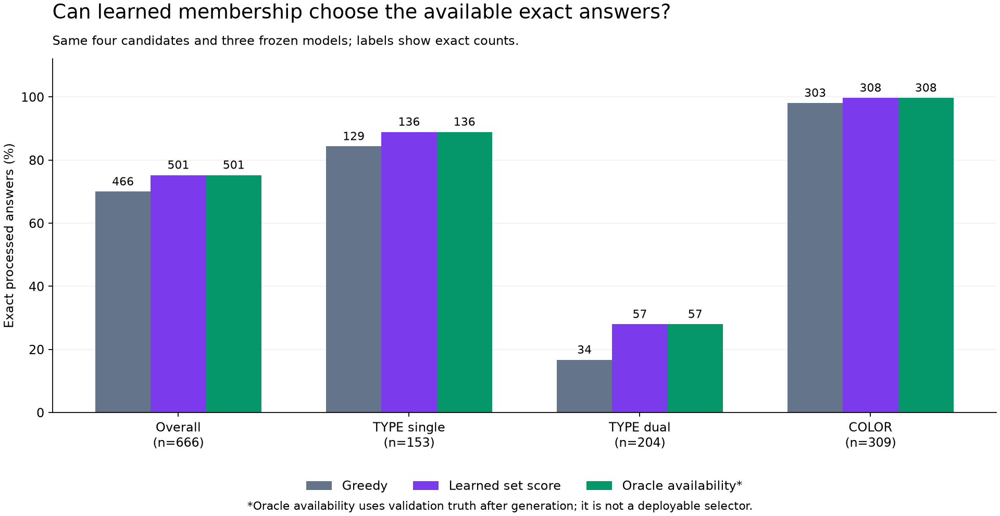

# Lesson 23: ranking complete answers with learned membership

**2026-09-24. Completed; the learned set selector passes the declared gate.**

[Lesson 22](22-first-choice-paths.md) found 501 exact answers among four candidate
paths per query, but sequence-score selection returned only 462 or 465, versus
466 from the original greedy decoder. We now hold the candidates and models
fixed and test one different ranking signal: the existing symmetric membership
head. This is **reranking**: choosing among already-generated answers.

## Two learned outputs answer different questions

The autoregressive decoder scores the next token given the preceding sequence.
Its sequence likelihood rewards paths it considers probable, which need not be
the paths with complete correct product sets.

The symmetric head scores whether each product belongs with the prompt subject
under TYPE or COLOR. It was trained with a separate membership objective, using
the shared product embeddings. Its question is closer to the final set task.
That is a reason to test it, not proof that its scores will select correctly.

We reuse the head already introduced in [Lesson 11](11-symmetric-relations.md)
and used for first-token guidance. No new weights, training, threshold or
score-combination coefficient are introduced here.

## From logits to a whole-set score

A **logit** z is a real-valued score. The sigmoid maps it to a value between
zero and one:

\[
\sigma(z)=\frac{1}{1+e^{-z}}.
\]

Under an independent Bernoulli interpretation, product v has membership
probability \(p_v=\sigma(z_v)\). For a candidate set S, its log score is:

\[
L(S)=\sum_{v\in S}\log\sigma(z_v)
+\sum_{v\notin S}\log\sigma(-z_v).
\]

The first term scores included products; the second scores excluded products.
Both are needed. Scoring only included positive probabilities would ignore the
cost of leaving out a product that the head strongly predicts should be present.

Using \(\log\sigma(z)-\log\sigma(-z)=z\), rearrange:

\[
L(S)=\underbrace{\sum_{v\in U}\log\sigma(-z_v)}_{C(x)}
+\sum_{v\in S}z_v.
\]

U is the fixed product vocabulary. The first term depends on the prompt x but
is identical for every candidate answer to that prompt. It cancels when ranking
those answers. We can therefore use the simpler equivalent ranking:

\[
\operatorname{set\_score}(S)=\sum_{v\in S}z_v.
\]

This does not discard the exclusion term arbitrarily; the algebra absorbs it
into the common constant. Scores from different prompts need not be comparable,
because their constants and logit distributions can differ.

## A small example

Imagine the head assigns these illustrative scores: A=3, B=2, C=-4.

| Candidate set | Score | Interpretation under these learned signs |
| --- | ---: | --- |
| {A} | 3 | Leaves out positively scored B |
| {A, B} | 5 | Highest-scoring candidate |
| {A, B, C} | 1 | Adding negatively scored C costs four points |

If the signs are appropriate, the score prefers the more complete correct set.
If the head incorrectly gives C a positive logit, it may favor an extra product.
There is no guarantee of correctness in the formula itself.

We do not threshold logits and assemble a new answer. The selector chooses one
of the four saved complete paths, retaining its raw token sequence and EOS.
Every candidate is evaluated under the same fixed downstream SAME processing,
which removes the subject and deduplicates IDs without consulting relations.

## What the tensors contain

The prompt IDs have shape `[B, 5]`, with `B<=8`. There are 1,025 product columns
in this vocabulary. The model returns `symmetric_relation_logits` with shape
`[B, 1025]`, explicitly computed in FP32.

The symmetric head uses normalized shared embeddings. With D=256, the product
matrix is `[1025, 256]`; the selected subject and dimension vectors are
`[B, 256]`. A learned `[256, 256]` projection maps the dimension vector to a
diagonal relation vector. Elementwise multiplication with the subject vector,
followed by multiplication against every product embedding, produces `[B, 1025]`.
This head depends on subject/dimension embeddings rather than a generated
prefix or teacher targets; the ordinary forward API also computes the decoder's
other outputs, but only the symmetric logits are used by this ranking rule.

Conceptually, four candidate indicator masks form `[B, 4, 1025]`. Multiplying
each mask by its query's logits and summing the last dimension gives `[B, 4]`
candidate scores. The experiment uses sorted distinct token IDs and `math.fsum`
over saved FP32 values so equal sets always get equal scores, even when their
raw output order differs. Lowest first-choice rank breaks an exact score tie.

Canonical sorting here is only for arithmetic. It does not reorder emitted IDs,
rewrite a path, or expose hidden graph attributes to inference.

## Why the probability interpretation needs care

The head was trained with balanced positive and negative losses. A query with
many more nonmembers than members does not let negatives dominate simply by
their count. This was a training choice to make the membership task useful.

It also means that sigmoid outputs should not automatically be interpreted as
calibrated empirical probabilities. The Bernoulli expression assumes independent
memberships; our graph contains related memberships, and the head shares weights
across products. We are testing a fixed ranking heuristic inspired by that
factorization, not claiming the resulting score is a calibrated probability of
the entire answer being correct.

The subject's diagonal membership score was excluded from symmetric training.
SAME postprocessing removes the subject from every candidate set, so its excluded
term is the same constant for all candidates. We neither learn nor impose a new
self-relation rule in this experiment.

## Frozen candidates keep the comparison interpretable

All 2,664 candidate paths come from the previous experiment. We recheck their
bytes, original checkpoint identities, source/runtime and data/split receipts.
The same 666 query-seed observations and all query groups remain in the test.
No new answer is generated, and no protected final-test query is evaluated.

The selector receives validated candidate IDs, eligibility and learned logits.
It chooses before truth-derived metrics are consulted. Tests perturb labels
and metrics while holding those inputs fixed; a changed choice would expose a
leak in this boundary.

Only valid, terminated, unique paths are eligible. A query with none retains
the rank-one failure and remains in the denominator. All paths in our frozen
campaign are eligible, but the fallback is still tested. The oracle ceiling
remains 501/666: a selector cannot invent an exact answer absent from its pool.

Acceptance still requires no per-seed F1 or exact regression against original
greedy, more than 466 pooled exact answers, more than 34 dual-TYPE exact answers,
and valid complete output throughout. The
[declared plan](../experiments/2026-09-24-set-reranking-plan.md) fixes the rule
before the run. Sequence sum/mean and the answer-key ceiling remain comparisons,
not alternative rules to choose after seeing results.

Reusing cached candidates makes this experiment inexpensive. A future service
would still have to generate those paths, so head-scoring time alone is not the
cost of the complete pipeline.

## Results: the head recognizes every available exact answer

| Seed | Greedy exact /222 | Set selector exact /222 | Greedy F1 | Set selector F1 |
| --- | ---: | ---: | ---: | ---: |
| 1729 | 156 | 168 | 90.20% | 95.23% |
| 1730 | 158 | 168 | 91.33% | 96.13% |
| 1731 | 152 | 165 | 88.84% | 95.32% |
| Pooled / mean | 466/666 | **501/666** | 90.12% | **95.56%** |

All three seeds improve F1 and exactness. There are 35 newly exact answers and
zero lost exact answers. Every selected path is valid, EOS-terminated and unique.
The pooled dual-TYPE exact count increases from 34 to 57, so every condition
of the declared acceptance gate passes.

| Exact answers by group | Greedy | Set selector | Available among four candidates |
| --- | ---: | ---: | ---: |
| Single TYPE | 129/153 | 136/153 | 136/153 |
| Dual TYPE | 34/204 | 57/204 | 57/204 |
| COLOR | 303/309 | 308/309 | 308/309 |

This is a learned selection result: the answer key did not choose the paths.
It matches the candidate pool's exact-answer availability on these validation
observations. It does **not** match the compiler's perfect correctness. Exactly
165 observations still lack an exact candidate. Nor are these 666 independent
queries: the same 222 held-out queries are evaluated across three frozen seeds.

Exact accuracy is 75.23%, while mean F1 is 95.56%. Exact accuracy gives an answer
credit only when its whole set is correct; F1 also rewards partially correct
sets. A high F1 therefore does not establish oracle parity.

The selector chooses ranks 1/2/3/4 on 547/59/30/30 observations. It often retains
greedy, but uses later candidates when their predicted memberships support them.
The earlier sum and mean sequence scores remain at 462 and 465 exact answers;
they have not been retroactively replaced in the preceding experiment.

## Two recovered decisions and one remaining error

INKAY / TYPE, seed1729, had an exact rank 4 candidate starting with MALAMAR.
Sequence likelihood failed to select it. The membership score is 1425.46 for
that path, versus -36.74 for rank 1, so the new rule selects the exact answer.

PALKIA / TYPE, seed1731, already had an exact greedy path starting with
DRACOVISH. Both sequence-score selectors abandoned it. Its set score is 2177.32,
above the incorrect ALTARIA path at 636.53 and ALOMOMOLA path at 1652.66.
The new selector keeps the exact answer.

The selector is not perfect among inexact candidates. On eight observations it
chooses a path below the best available F1. ARMALDO / COLOR, seed1729, is the
largest gap: selected F1 is 0.0118 while another saved path reaches 0.1887.
None of its four paths is exact. Mean best-available F1 is 95.60%, slightly above
the learned selector's 95.56%. Capturing every available **exact** answer does
not mean maximizing every query's F1.

## What was verified and what remains

All 666 saved FP32 head vectors and 2,664 candidate scores are preserved.
An independent CPU audit reconstructs canonical sums, the Bernoulli identity,
candidate eligibility, selected raw IDs, metrics, subgroup changes and provenance.
It does not independently recompute neural logits. The full suite passes
476 tests, including 19 new focused tests; Ruff, formatting and strict typing
for 59 source files pass.

Synchronized head forward calls took 2.80 seconds across all three models:
2.396 seconds for the first seed, then 0.194 and 0.211 seconds. The first run
dominates that observation; this is not a repeated steady-state benchmark.
Peak allocated GPU memory for this scoring stage was 36.58 MiB. The earlier
candidate generation took 485.24 seconds and remains part of the eventual
pipeline cost. The script separately records loading/validation/measurement
wall time so it is not confused with the timed model calls.

This successful validation comparison makes the rule an integration candidate.
It is currently an offline experiment over saved paths. The
[next integration contract](../experiments/2026-09-24-set-reranking-integration-plan.md)
requires fresh candidate generation, complete output parity, and native HTTP
checks before claiming that the normal application implements it. The original
training checkpoints and all preceding experiments retain their identities.

Oracle-quality parity, protected final-test evaluation, and serving throughput,
latency and energy at matched quality remain unfinished.

## Evidence and self-check

- [Declared experiment](../experiments/2026-09-24-set-reranking-plan.md).
- [Portable results](../experiments/2026-09-24-set-reranking.json).
- Full local evidence: `runs/learning/set-reranking-v1/`.
- Summary SHA256: `c515fae06f7db1810e8697badf59d53ffb41675cbb8fc543d1a14feee7252c5c`.
- Independent audit SHA256: `22d55b7b58b988d53e78ef4f0bf167f24a2b52e2a27d3f53b603dd00fbeeb2aa`.

Explain why summing member logits includes an exclusion penalty up to a common
constant. Then explain why matching all 501 available exact answers still leaves
two separate tasks: producing better candidates and verifying the full serving
implementation and its cost.
