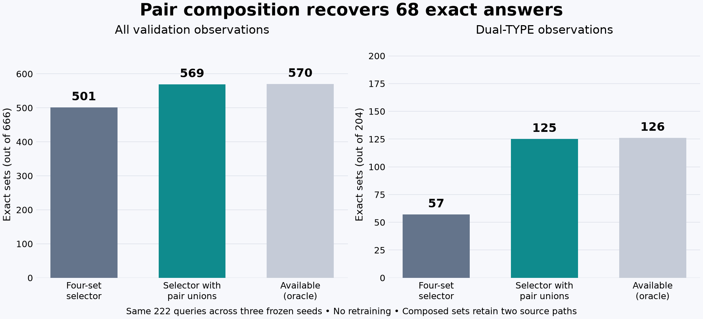

# 25. Can two partial answers make a complete one?

**Status:** completed and independently audited. The learned selector reaches
569/666 exact sets, up from 501, with 68 gains and zero exact-answer losses.
Every declared gate passes. This is an offline composition experiment; the
existing four-path application integration campaign continues independently.

Our four generated candidates sometimes contain complementary pieces of the
right answer. The saved-path diagnosis found 69 remaining failures where two
whole candidates together would be exact. All are dual-TYPE queries. This gives
us a candidate-generation idea, but it does not tell the model which pair to use.

## Expand the choices without changing the scorer

Call the four original SAME-processed sets S1, S2, S3 and S4. Keep them, then add
the six distinct pair unions. That gives ten candidate slots:

| Slots | Members |
| --- | --- |
| 1–4 | S1, S2, S3, S4 |
| 5–7 | S1 union S2, S1 union S3, S1 union S4 |
| 8–10 | S2 union S3, S2 union S4, S3 union S4 |

Two slots may contain the same set. We retain both slots and their source ranks,
so their provenance and the declared tie order remain visible. A tie prefers
the earliest slot, giving original candidates priority over their compositions.

The selector still uses the saved symmetric membership logits:

\[
s(S)=\sum_{i\in S}z_i.
\]

There is no new coefficient, threshold, learned parameter, or forward pass.
Every TYPE and COLOR query gets the same ten-slot pool. The selector never sees
oracle memberships or the fact that a query belongs to the dual-TYPE subgroup.

## What the union adds to the score

The union contains every distinct product in A or B. Shared products count once:

\[
s(A\cup B)=s(A)+\sum_{i\in B\setminus A}z_i.
\]

This is an incremental decision: are B's new products worth adding to A? Positive
logits increase the score and negative logits decrease it. The scorer does not
learn a new interaction between A and B; it reuses per-product membership evidence.
Wrong positive logits can therefore reward a bad addition.

For a toy example, let A={a,b}, B={b,c}, with logits z=(3,2,4). Their scores are
5, 6 and 9 for A, B and their union. The shared b contributes only once. If c's
logit were -4 instead, A would score 5 while the union would score 1. This says
what the model believes about c, not whether c is actually correct.

## Tensor interpretation

The learned head supplies Z with shape [B,1025], one logit per query and product.
Conceptually, represent the ten sets by a Boolean membership tensor C with shape
[B,10,1025]. Then the score matrix has shape [B,10]:

\[
s_{bc}=\sum_i C_{bci}Z_{bi}.
\]

The actual reference implementation uses integer ID sets and canonical ascending
ID `math.fsum` on the CPU. The tensor view explains the operation; it does not
claim that we allocate this dense tensor or run a new neural model. All FP32
head values come from the already frozen experiment.

## A composed set is different evidence from a generated path

Each original path has raw tokens, a termination flag and protocol checks. A
union is a deterministic composition of two completed paths. The autoregressive
model did not emit that union as one sequence.

We therefore retain the two source paths and record the selected product set
separately. We do not invent a raw token sequence, EOS, or sequence probability
for the composition. A pair is eligible only when both source paths are valid,
terminated and unique. If every candidate is ineligible, the original rank-one
failure is preserved and receives no valid exact-answer credit.

This distinction matters before any serving integration. The current service's
raw response describes one generated path. Composition would require an explicit
representation of multiple source paths and the selected set, with its own
verification contract.

## What would count as progress?

The comparator is the stronger learned four-set selector: 501/666 exact answers
and 95.56% mean F1. We require no per-seed overall F1 or exact-count regression,
strict pooled exact improvement, and strict pooled dual-TYPE exact improvement.
The original 466-answer greedy decoder is useful context but is not the gate.

The diagnosis predicts 570/666 exact answers available in this ten-candidate pool.
That number uses oracle labels to identify possible answers. The learned selector
must make its choice first, before those labels are used to measure the result.

## Measured result

All 666 original four-set selections and scores replayed exactly before the new
selection rule ran. The ten-slot experiment then produced:

| Seed | Four-set exact | With pairs | Exact gains / losses | Four-set F1 | With pairs F1 |
| --- | ---: | ---: | ---: | ---: | ---: |
| 1729 | 168 | 191 | 23 / 0 | 95.23% | 96.29% |
| 1730 | 168 | 192 | 24 / 0 | 96.13% | 97.31% |
| 1731 | 165 | 186 | 21 / 0 | 95.32% | 96.47% |
| Pooled / mean | 501 | 569 | 68 / 0 | 95.56% | 96.69% |

These are the same 222 validation queries across three trained seeds. They are
666 query-seed observations, not 666 independent held-out queries.

All 68 exact gains occur in dual TYPE: 57/204 becomes 125/204. Single-TYPE exact
answers stay at 136/153 and COLOR at 308/309. The selector chooses 90 pairs and
576 originals; all pair choices happen to be dual TYPE, although the selector
receives no subgroup labels and applies the same pool to every query.

Mean recall improves from 94.07% to 96.38%, while precision decreases from 98.70%
to 98.20%. The added coverage outweighs the extra false positives in mean F1.
Exact-set accuracy is 85.44%, so this is still short of oracle parity.

## One success and one informative failure

SOLROCK / TYPE, seed 1729, now selects source paths 1 and 3. Their union is exact,
with score 1382.03 versus 923.18 and 503.40 for the individual sets. Other pair
unions introduce wrong members and score lower. The learned rule recognizes the
useful composition without being told that these two paths cover the truth.

PILOSWINE / TYPE, seed 1731, is the only available exact answer the selector
misses. Pair (1,3) is exact and scores 877.4085. Pair (1,4) scores 878.3962 but
swaps the correct REGICE for the incorrect ANORITH. The head logits explain why:

| Product | Membership truth | Head logit |
| --- | --- | ---: |
| REGICE | Correct member | -2.5726 |
| ANORITH | Incorrect member | -1.5849 |

Both logits are negative, but the wrong member receives the smaller penalty.
That makes the incorrect swap worth about +0.9877 to the scorer. This is a
concrete ranking error in the learned membership signal.

It is also the only per-query F1 regression: 0.99578 becomes 0.99160. Neither
answer was exact, so the experiment can have zero exact-answer losses while
still making this query worse. There are 97 inexact observations remaining:
96 lack an exact candidate in the ten-slot pool, and this one is misselected.

## Verification, cost and next boundary

Forty focused CPU tests cover the numeric boundary, pair construction, duplicate
slots, ties, source eligibility, invalid fallback and truth-independent choice.
An independent standard-library audit reconstructs all 6,660 slots, scores,
choices, source paths, metrics, groups, gate conditions and provenance receipts.
Neither script imports Torch or recomputes neural logits.

Constructing and scoring all ten-slot pools took 0.30 seconds on the CPU. This
excludes input authentication, reporting and the earlier neural computation.
The original four-path generation took 485.24 seconds across the three seeds;
its cost remains part of the eventual pipeline. These observations are not a
benchmark of an integrated composition service.

The next engineering boundary is explicit multi-source evidence and selected-set
evaluation. Composition must not silently become a fabricated `GenerationResult`.
The existing four-path HTTP campaign must finish under its unchanged contract;
any composition integration needs a separate declaration and full replay.

Read the [declared experiment](../experiments/2026-09-24-pair-union-plan.md) and
[coverage diagnosis](../experiments/2026-09-24-set-candidate-coverage.json).
The [portable results](../experiments/2026-09-24-pair-unions.json) preserve the
comparison and receipts. Full local evidence is in `runs/learning/pair-unions-v1/`.

- Summary SHA256: `4e4c46d4ebc366e02aa04cc3abda1a65cc08cec5463453ba97e25b4bc3f53992`.
- Independent audit SHA256: `13d9b88135eb52c768932e213cc475ac5994636a7fc228b1a7b2ad8ab538a057`.

## Self-check

Why can a larger candidate pool make the chosen answer worse? Which term in
the union-score equation accounts for overlap? What evidence would be lost if
we serialized a union and labeled it as the model's original raw output?
