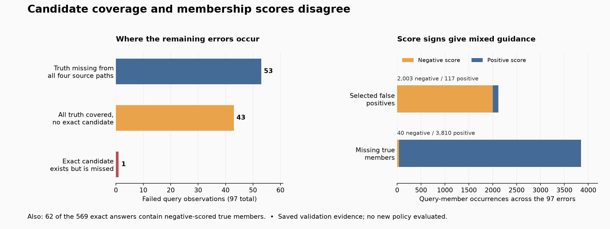

# 27. Why a sensible cleanup rule would lose correct answers

**Status:** completed saved-evidence diagnosis, independently recomputed. No new
selection policy, training run or protected-test evaluation was performed.
The composition application's separate replay passes offline checks but stops
at its first HTTP checkpoint on exact score differences; see lesson 26.

The pair experiment returns 569 exact answers in 666 query-seed observations.
What is wrong with the other 97? Before adding another mechanism, we can inspect
the existing evidence. This is diagnosis: ground truth helps explain failures,
but it does not enter the runtime selector.



## Coverage and ranking are different problems

An answer can fail because the candidate pool never contains the right set, or
because the selector overlooks an exact candidate that is available.

| Among the 97 errors | Count | What this tells us |
| --- | ---: | --- |
| Some true member is absent from all four source paths | 53 | Unions of these sources cannot recover the missing member |
| All true members are covered, but no ten-slot candidate is exact | 43 | Existing candidates retain wrong members; choosing another whole slot cannot be exact |
| An exact candidate exists but is not selected | 1 | This is a ranking miss: PILOSWINE / TYPE, seed 1731 |

The first two rows give 96 errors with no exact candidate. In the remaining 44
fully covered cases, at least one slot contains every true member, although it
may contain extras. The fixed pool contains exact answers for 570 observations;
selection finds 569. **With these frozen candidates, better ranking alone can
add at most one exact answer.** It could still improve F1 on other queries.

The errors are concentrated in dual TYPE: 79 dual-TYPE, 17 single-TYPE and one
COLOR observation. These groups are analysis labels, not extra runtime inputs.

## Read the tensors as sets

For a query batch, the symmetric head produces logits **Z [B, 1025]**.
Let **Y [B, 1025]** be the truth-membership mask and **M [B, 1025]** the selected
set mask. The diagnostic concepts correspond to ordinary elementwise operations:

```python
true_positive = M & Y
false_positive = M & ~Y
false_negative = ~M & Y
source_union = C[:, :4, :].any(dim=1)  # C is the conceptual ten-slot mask
missing_from_every_source = Y & ~source_union
```

These are conceptual tensor operations; the audit uses Python sets over saved
identifiers. The masks have one column per product, with no control tokens or
hidden attribute nodes. In this analysis, B can also mean all 666 saved
observations after combining the three seeds.

A positive logit z means sigmoid(z) is above one half; a negative logit means
it is below one half. That is a statement about the score transformation, not a
guarantee that the product belongs or does not belong in the answer.

| Members in the 97 failed selected sets | Negative score | Positive score | Total |
| --- | ---: | ---: | ---: |
| Selected false positives | 2,003 | 117 | 2,120 |
| Missing true members | 40 | 3,810 | 3,850 |

There are no zero scores in these groups. These counts are **query-member
occurrences**, not counts of distinct Pokémon. One product can appear in many
queries and seeds.

Of the 3,850 missing occurrences, 3,134 are absent from all four source paths;
3,100 of those have positive scores. Another 716 are present in some source but
absent from the selected set; 710 have positive scores. The auxiliary head often
favors a product that the final answer omits. This localizes a coverage problem;
it does not by itself establish why the autoregressive decoder omitted it.

## Why we cannot simply delete negative-scored members

The false-positive row makes this tempting: most selected wrong members have
negative scores. But **62 of the 569 already-exact answers contain negative-scored
true members**. Deleting those members loses 103 correct query-member occurrences.
The affected exact-answer counts are 20, 18 and 24 across the three seeds.

For example, the seed-1729 answer for BERGMITE / TYPE is exact with 47 members.
Its true member ARCTIBAX has score approximately **-0.547853**. The whole set is
correct even though one member's auxiliary score is on the wrong side of zero.

We can bound the damage of a specific proposed postprocessing rule without
executing it: **take each currently selected set and delete every negative-scored
member**. Among the 97 existing failures, 63 have only missing members, 17 have
only extras, and 17 have both. Deletion cannot restore any missing member, so
at most the 17 extras-only cases could become exact. Meanwhile, the 62 currently
exact answers above necessarily become inexact:

\[
\text{exact answers after this deletion rule}
\leq 569 - 62 + 17 = 524.
\]

That is an upper bound, not a measured alternative-policy result. Even the best
case loses at least 45 exact answers. Its scope is deletion-only postprocessing
of the selected outputs; it is not a statement about every possible future
candidate-construction or training method.

## A larger search space can expose a scorer's mistakes

Our set score is a sum of membership logits:

\[
s(S)=\sum_{i\in S} z_i.
\]

If every subset were allowed, maximizing this score would include every product
with a positive score and exclude every product with a negative score; zero-score
members would be ties. Each membership decision would be independent.

Our generated candidates impose an additional restriction. They can preserve a
coherent exact set containing a weakly scored true member. The BERGMITE example
shows why this restriction sometimes helps. Expanding the candidate pool lets
the selector find better-scoring sets, but a higher learned score need not mean
a more accurate set. We must evaluate that relationship rather than assume it.

## The loss balances classes; it does not promise calibration

For one query, let T be the true members and N the other products, excluding the
subject. The current auxiliary loss implemented in `_prompt_set_loss` is:

\[
L_q=\frac12\left(
\frac{1}{|T|}\sum_{i\in T}\operatorname{softplus}(-z_i)
+\frac{1}{|N|}\sum_{i\in N}\operatorname{softplus}(z_i)
\right).
\]

Positive and negative groups each receive half the weight, regardless of their
different sizes. This helps prevent the many negatives from dominating training.
It does not make every sign correct, nor does it establish that sigmoid outputs
are calibrated empirical probabilities. See [lesson 23](23-ranking-candidate-sets.md)
for the distinction between the set-ranking heuristic and a probability of the
whole answer being correct.

## Evidence and the next decision

The [portable diagnosis](../experiments/2026-09-24-pair-error-diagnosis.json)
contains the counts, counterexample, logical bound and source/audit hashes.
The diagnostic and an independently written standard-library audit recompute
the results from authenticated saved validation rows. Neither imports Torch,
executes the model nor chooses a new threshold or policy.

The [application replay](26-integrating-composed-sets.md) still needs to finish.
For later research, the evidence calls for candidate construction that can
recover missing members while preserving already-correct sets. A new experiment
must declare its rule and acceptance criteria before measuring it. The graph
oracle remains perfect; 569/666 is not oracle parity.
