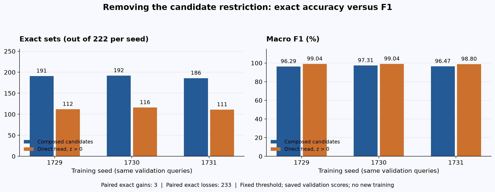

# 28. What does the candidate restriction contribute?

**Status:** completed and independently audited; the fixed rule fails its
acceptance gate. Mean F1 rises from 96.69% to 98.96%, but exact answers fall from
569 to 339 out of 666. This is a saved-score ablation, separate from the
composition application's GPU/HTTP replay. It is not promoted to runtime.



## The result: almost every member can be right while many sets are wrong

| Training seed | Composed exact | Direct-head exact | Composed F1 | Direct-head F1 | Exact gains / losses |
| --- | ---: | ---: | ---: | ---: | ---: |
| 1729 | 191/222 | 112/222 | 96.29% | 99.04% | 1 / 80 |
| 1730 | 192/222 | 116/222 | 97.31% | 99.04% | 1 / 77 |
| 1731 | 186/222 | 111/222 | 96.47% | 98.80% | 1 / 76 |
| Pooled | 569/666 | 339/666 | 96.69% | 98.96% | 3 / 233 |

Macro recall increases from 96.38% to 99.75%, and macro precision changes from
98.20% to 98.23%. Nevertheless, exact-set accuracy falls from 85.44% to 50.90%.
The rule fixes only three previously inexact answers while damaging 233 exact
ones. Every seed fails the exact-count nonregression requirement. Dual-TYPE exact
answers fall from 125/204 to 13/204; COLOR falls from 308/309 to 238/309, and
single-TYPE falls from 136/153 to 88/153.

These are compatible results. Partial-credit metrics reward correcting many
members in a few badly incomplete answers. Exact accuracy also counts all the
formerly correct answers spoiled by even one new error. Average set size grows
from 125.52 to 130.26 members; no query predicts an empty set.

## Remove one restriction to understand it

Our current system generates four token sequences, builds ten candidate sets
from originals and pair unions, and chooses a set using learned membership scores.
The [previous diagnosis](27-remaining-errors-and-score-signs.md) found that 96
of its 97 remaining mistakes have no exact set among those ten candidates.

An **ablation** removes or changes a component to measure its contribution. Here
we remove the restriction to those ten sets while keeping the model weights and
saved membership scores fixed. We ask the head to predict membership directly.
This tests whether the candidate restriction helps or hurts these checkpoints;
it does not explain every reason the token generator succeeds or fails.

This is not our first look at a classifier: [lesson 11](11-symmetric-relations.md)
measured the direct head on an earlier checkpoint. The new experiment uses the
current three-checkpoint saved evidence, the stronger pair-composition baseline,
and paired per-query changes. Those identities and comparisons matter; an older
aggregate result cannot stand in for this measurement.

The rule is deliberately precise: include each non-subject product whose saved
logit is strictly positive. Zero, including negative zero, means exclusion.
An empty prediction stays empty. No threshold sweep, top-k, expected answer size,
graph lookup, fallback or dimension-specific rule enters prediction.

## Why zero is the fixed threshold

The existing candidate score is additive:

\[
s(S)=\sum_{i\in S}z_i.
\]

Adding one product changes the score by exactly its logit z_i, independently of
the other products. Over every allowed subset, a maximizer therefore contains
all positive-logit products and no negative-logit products. Zero-logit members
do not change the score; our declared tie rule excludes them. The subject is
excluded by SAME semantics regardless of its score.

\[
S^*=\{i: i\ne\text{subject},\ z_i>0\}.
\]

For a tiny example, suppose three non-subject products have logits
`[2.0, -0.4, 0.0]`. Selecting only the first gives score 2.0. Adding the second
lowers it to 1.6; adding the third ties. If the second product is actually a true
member, maximizing this learned score still excludes it. A score optimum and a
correct answer are different concepts.

No combinatorial search is needed despite there being exponentially many sets:
the objective separates into independent membership choices. That is also its
limitation: it contains no explicit interaction term requiring products to be
selected together.

## Where the logits come from

The symmetric relation head uses shared entity embeddings and the dimension
embedding. Unlike the other prompt-set head, its formula does not use a
transformer's contextual ANSWER hidden state. The implementation is in
`src/plm/model/layers.py`, in the symmetric auxiliary path of `PLMDecoder.forward`.

With embedding width D=256 and 1,025 products, let E be the normalized product
embeddings scaled by sqrt(D). Let A contain dimension embeddings normalized and
scaled in the same way, and let R = A W^T be their learned projection for a batch
of queries. R itself is not normalized:

\[
E\in\mathbb{R}^{1025\times256},\quad
E_{subject}\in\mathbb{R}^{B\times256},\quad
R\in\mathbb{R}^{B\times256}.
\]

The head computes:

\[
Z=\frac{(E_{subject}\odot R)E^\top}{\sqrt{256}}
\in\mathbb{R}^{B\times1025}.
\]

The elementwise product applies dimension-dependent weights to the subject's
features; the matrix product compares that vector against all products. Shared
entity vectors on both sides make the relation score mathematically symmetric
when the dimension is fixed. This symmetry describes the formula; floating-point
computation across different batch shapes can still round intermediate results
differently.

Independent membership choices at selection time do not mean independent learned
parameters. For one fixed dimension, the full subject-by-product score matrix is
E diag(r) E^T / sqrt(D), with rank at most D=256. A shared embedding update can
change many scores at once. The low-rank structure is a modeling constraint;
the rank bound alone does not prove that our target relation is unlearnable.

The direct prediction is conceptually:

```python
members = Z > 0                       # bool [B, 1025]
members[batch_indices, subject_ids - 1024] = False
```

The actual experiment uses saved FP32 logits represented as Python floats and
product IDs, without
importing Torch or running this tensor expression. The current model's public
forward method also computes transformer outputs. Reading this head formula
does not establish that current serving skips that work, or that an optimized
head-only service would be faster end to end.

## We already know one cost of this ablation

The saved diagnosis identifies 62 currently exact answers containing at least
one negative-scored true member. This rule necessarily damages all 62: adding
other products cannot restore a true member excluded by the threshold.

That does not determine the overall result. Direct prediction can also recover
members absent from every generated path. Unlike the deletion-only rule in
lesson 27, it can add products, so the earlier 524 upper bound does not apply.
We measured both recoveries and damage across every query:

| Membership change, counted per query and seed | Occurrences |
| --- | ---: |
| Recovered missing true members | 3,810 |
| Removed wrong members | 2,003 |
| Added new wrong members | 1,556 |
| Lost previously selected true members | 206 |

Of the recovered members, 3,100 had been absent from all four source paths.
So the intended coverage recovery occurs. But among the 569 formerly exact
answers, direct prediction adds 795 wrong-member occurrences and loses 103 true
ones. Those changes spread across 233 spoiled answers. The known 62-loss bound
was only a minimum: positive-scored nonmembers cause substantial additional harm.

These are query-member occurrences, not distinct products. The four categories
compare the same frozen baseline and direct prediction; they are not separately
tuned interventions.

We separate four membership changes: recovered false negatives, newly introduced
false positives, removed false positives, and newly lost true members. Exact
set accuracy requires no wrong or missing member; macro F1 gives partial credit
and averages each query equally. Both matter because a large set can have high
F1 despite still being wrong.

## What counts as evidence

The [declared plan](../experiments/2026-09-24-direct-membership-plan.md) fixes one
rule and all acceptance conditions before measurement. First we reconstruct the
accepted 569/666 pair baseline. Then we evaluate the new sets and independently
recompute the result from authenticated saved inputs. Both steps are complete:
all 666 direct predictions and per-query metrics match the independent audit.
The evaluator's 23 focused CPU tests cover the fixed threshold, subject/zero
behavior, empty metrics, additive optimality on tiny exhaustive examples,
identity drift and immutable outputs. The final full suite passes all 684 tests;
lint, formatting and strict typing checks pass. One new test initially failed
only in the full suite because earlier tests had imported Torch into pytest's
shared process. Running that standalone command scenario in a fresh interpreter
fixed the test isolation without weakening the evaluator's no-Torch check.

The declared gate requires no seed's overall exact count or macro
F1 to regress, plus strict pooled exact and dual-TYPE exact improvements. A failed
gate remains a reported failure. We do not rescue it by quietly trying another
threshold in the same experiment. This rule fails the gate and remains an
experimental diagnostic. The [portable report](../experiments/2026-09-24-direct-membership.json)
preserves all metrics, gates and source/audit hashes.

Saved-score validation and set construction take approximately 0.143 seconds
in this execution, excluding the head forward, authentication and reporting.
That is an analysis timing, not a fair speed comparison against a running decoder.

The practical implication is narrower than "the head is bad": it is a useful
set-ranking signal and has strong membership F1, while its unrestricted optimum
has poor exact accuracy. Future candidate expansion must address both missing
coverage and errors introduced by unconstrained membership choices. This result
does not select a new threshold, hybrid rule or training objective.

The three seeds use the same 222 validation queries. Their 666 observations are
not 666 independent held-out queries, and validation has already guided many
development choices. Protected final-test evidence remains separate. The graph
oracle remains perfect, and thresholding saved scores measures no end-to-end
latency, throughput or energy benefit.
